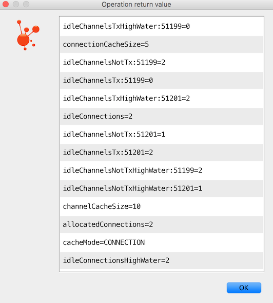

[[amqp]]
=== Using Spring AMQP

In this chapter, we will explore the interfaces and classes that are the essential components for developing applications with Spring AMQP.

==== AMQP Abstractions

===== Introduction

Spring AMQP consists of a handful of modules, each represented by a JAR in the distribution.
These modules are: spring-amqp, and spring-rabbit.
The 'spring-amqp' module contains the `org.springframework.amqp.core` package.
Within that package, you will find the classes that represent the core AMQP "model".
Our intention is to provide generic abstractions that do not rely on any particular AMQP broker implementation or client library.
End user code will be more portable across vendor implementations as it can be developed against the abstraction layer only.
These abstractions are then used implemented by broker-specific modules, such as 'spring-rabbit'.
There is currently only a RabbitMQ implementation; however the abstractions have been validated in .NET using Apache Qpid in addition to RabbitMQ.
Since AMQP operates at the protocol level in principle, the RabbitMQ client can be used with any broker that supports the same protocol version, but we do not test any other brokers at present.

The overview here assumes that you are already familiar with the basics of the AMQP specification.
If you are not, then have a look at the resources listed in <<resources>>

===== Message

The 0-9-1 AMQP specification does not define a Message class or interface.
Instead, when performing an operation such as `basicPublish()`, the content is passed as a byte-array argument and additional properties are passed in as separate arguments.
Spring AMQP defines a Message class as part of a more general AMQP domain model representation.
The purpose of the Message class is to simply encapsulate the body and properties within a single instance so that the API can in turn be simpler.
The Message class definition is quite straightforward.

[source,java]
----
public class Message {

    private final MessageProperties messageProperties;

    private final byte[] body;

    public Message(byte[] body, MessageProperties messageProperties) {
        this.body = body;
        this.messageProperties = messageProperties;
    }

    public byte[] getBody() {
        return this.body;
    }

    public MessageProperties getMessageProperties() {
        return this.messageProperties;
    }
}
----

The `MessageProperties` interface defines several common properties such as 'messageId', 'timestamp', 'contentType', and several more.
Those properties can also be extended with user-defined 'headers' by calling the `setHeader(String
      key, Object value)` method.

[IMPORTANT]
====
Starting with versions `1.5.7`, `1.6.11`, `1.7.4`, `2.0.0`, if a message body is a serialized `Serializable` java object, it is no longer deserialized (by default) when performing `toString()` operations (such as in log messages).
This is to prevent unsafe deserialization.
By default, only `java.util` and `java.lang` classes are deserialized.
To revert to the previous behavior, you can add allowable class/package patterns by invoking `Message.addWhiteListPatterns(...)`.
A simple `*` wildcard is supported, for example `com.foo.*, *.MyClass`.
Bodies that cannot be deserialized will be represented by `byte[<size>]` in log messages.
====

===== Exchange

The `Exchange` interface represents an AMQP Exchange, which is what a Message Producer sends to.
Each Exchange within a virtual host of a broker will have a unique name as well as a few other properties:

[source,java]
----
public interface Exchange {

    String getName();

    String getExchangeType();

    boolean isDurable();

    boolean isAutoDelete();

    Map<String, Object> getArguments();

}
----

As you can see, an Exchange also has a 'type' represented by constants defined in `ExchangeTypes`.
The basic types are: `Direct`, `Topic`, `Fanout`, and `Headers`.
In the core package you will find implementations of the `Exchange` interface for each of those types.
The behavior varies across these Exchange types in terms of how they handle bindings to Queues.
For example, a Direct exchange allows for a Queue to be bound by a fixed routing key (often the Queue's name).
A Topic exchange supports bindings with routing patterns that may include the '*' and '#' wildcards for 'exactly-one' and 'zero-or-more', respectively.
The Fanout exchange publishes to all Queues that are bound to it without taking any routing key into consideration.
For much more information about these and the other Exchange types, check out <<resources>>.

NOTE: The AMQP specification also requires that any broker provide a "default" Direct Exchange that has no name.
All Queues that are declared will be bound to that default Exchange with their names as routing keys.
You will learn more about the default Exchange's usage within Spring AMQP in <<amqp-template>>.

===== Queue

The `Queue` class represents the component from which a Message Consumer receives Messages.
Like the various Exchange classes, our implementation is intended to be an abstract representation of this core AMQP type.

[source,java]
----
public class Queue  {

    private final String name;

    private volatile boolean durable;

    private volatile boolean exclusive;

    private volatile boolean autoDelete;

    private volatile Map<String, Object> arguments;

    /**
     * The queue is durable, non-exclusive and non auto-delete.
     *
     * @param name the name of the queue.
     */
    public Queue(String name) {
        this(name, true, false, false);
    }

    // Getters and Setters omitted for brevity

}
----

Notice that the constructor takes the Queue name.
Depending on the implementation, the admin template may provide methods for generating a uniquely named Queue.
Such Queues can be useful as a "reply-to" address or other *temporary* situations.
For that reason, the 'exclusive' and 'autoDelete' properties of an auto-generated Queue would both be set to 'true'.

NOTE: See the section on queues in <<broker-configuration>> for information about declaring queues using namespace support, including queue arguments.

===== Binding

Given that a producer sends to an Exchange and a consumer receives from a Queue, the bindings that connect Queues to Exchanges are critical for connecting those producers and consumers via messaging.
In Spring AMQP, we define a `Binding` class to represent those connections.
Let's review the basic options for binding Queues to Exchanges.

You can bind a Queue to a DirectExchange with a fixed routing key.

[source,java]
----
new Binding(someQueue, someDirectExchange, "foo.bar")
----

You can bind a Queue to a TopicExchange with a routing pattern.

[source,java]
----
new Binding(someQueue, someTopicExchange, "foo.*")
----

You can bind a Queue to a FanoutExchange with no routing key.

[source,java]
----
new Binding(someQueue, someFanoutExchange)
----

We also provide a `BindingBuilder` to facilitate a "fluent API" style.

[source,java]
----
Binding b = BindingBuilder.bind(someQueue).to(someTopicExchange).with("foo.*");
----

NOTE: The BindingBuilder class is shown above for clarity, but this style works well when using a static import for the 'bind()' method.

By itself, an instance of the Binding class is just holding the data about a connection.
In other words, it is not an "active" component.
However, as you will see later in <<broker-configuration>>, Binding instances can be used by the `AmqpAdmin` class to actually trigger the binding actions on the broker.
Also, as you will see in that same section, the Binding instances can be defined using Spring's `@Bean`-style within `@Configuration` classes.
There is also a convenient base class which further simplifies that approach for generating AMQP-related bean definitions and recognizes the Queues, Exchanges, and Bindings so that they will all be declared on the AMQP broker upon application startup.

The `AmqpTemplate` is also defined within the core package.
As one of the main components involved in actual AMQP messaging, it is discussed in detail in its own section (see <<amqp-template>>).

[[connections]]
==== Connection and Resource Management

===== Introduction

Whereas the AMQP model we described in the previous section is generic and applicable to all implementations, when we get into the management of resources, the details are specific to the broker implementation.
Therefore, in this section, we will be focusing on code that exists only within our "spring-rabbit" module since at this point, RabbitMQ is the only supported implementation.

The central component for managing a connection to the RabbitMQ broker is the `ConnectionFactory` interface.
The responsibility of a `ConnectionFactory` implementation is to provide an instance of `org.springframework.amqp.rabbit.connection.Connection` which is a wrapper for `com.rabbitmq.client.Connection`.
The only concrete implementation we provide is `CachingConnectionFactory` which, by default, establishes a single connection proxy that can be shared by the application.
Sharing of the connection is possible since the "unit of work" for messaging with AMQP is actually a "channel" (in some ways, this is similar to the relationship between a Connection and a Session in JMS).
As you can imagine, the connection instance provides a `createChannel` method.
The `CachingConnectionFactory` implementation supports caching of those channels, and it maintains separate caches for channels based on whether they are transactional or not.
When creating an instance of `CachingConnectionFactory`, the 'hostname' can be provided via the constructor.
The 'username' and 'password' properties should be provided as well.
If you would like to configure the size of the channel cache (the default is 25), you could call the
`setChannelCacheSize()` method here as well.

Starting with _version 1.3_, the `CachingConnectionFactory` can be configured to cache connections as well as just channels.
In this case, each call to `createConnection()` creates a new connection (or retrieves an idle one from the cache).
Closing a connection returns it to the cache (if the cache size has not been reached).
Channels created on such connections are cached too.
The use of separate connections might be useful in some environments, such as consuming from an HA cluster, in
conjunction with a load balancer, to connect to different cluster members.
Set the `cacheMode` to `CacheMode.CONNECTION`.

NOTE: This does not limit the number of connections, it specifies how many idle open connections are allowed.

Starting with _version 1.5.5_, a new property `connectionLimit` is provided.
When this is set, it limits the total number of connections allowed.
When set, if the limit is reached, the `channelCheckoutTimeLimit` is used to wait for a connection to become idle.
If the time is exceeded, an `AmqpTimeoutException` is thrown.

[IMPORTANT]
======
When the cache mode is `CONNECTION`, automatic declaration of queues etc.
(See <<automatic-declaration>>) is NOT supported.

Also, at the time of writing, the `rabbitmq-client` library creates a fixed thread pool for each connection (5 threads) by default.
When using a large number of connections, you should consider setting a custom `executor` on the `CachingConnectionFactory`.
Then, the same executor will be used by all connections and its threads can be shared.
The executor's thread pool should be unbounded, or set appropriately for the expected utilization (usually, at least one thread per connection).
If multiple channels are created on each connection then the pool size will affect the concurrency, so a variable (or simple cached) thread pool executor would be most suitable.
======
It is important to understand that the cache size is (by default) not a limit, but merely the number of channels that can be cached.
With a cache size of, say, 10, any number of channels can actually be in use.
If more than 10 channels are being used and they are all returned to the cache, 10 will go in the cache; the remainder will be physically closed.

Starting with _version 1.6_, the default channel cache size has been increased from 1 to 25.
In high volume, multi-threaded, environments, a small cache means that channels are created and closed at a high rate.
Increasing the default cache size will avoid this overhead.
You should monitor the channels in use via the RabbitMQ Admin UI and consider increasing the cache size further if you
see many channels being created and closed.
The cache will only grow on-demand (to suit the concurrency requirements of the application) so this change will not
impact existing low-volume applications.

Starting with _version 1.4.2_, the `CachingConnectionFactory` has a property `channelCheckoutTimeout`.
When this property is greater than zero, the `channelCacheSize` becomes a limit on the number of channels that can be created on a connection.
If the limit is reached, calling threads will block until a channel is available or this timeout is reached, in which case a `AmqpTimeoutException` is thrown.

WARNING: Channels used within the framework (e.g.
`RabbitTemplate`) will be reliably returned to the cache.
If you create channels outside of the framework, (e.g.
by accessing the connection(s) directly and invoking `createChannel()`), you must return them (by closing) reliably, perhaps in a `finally` block, to avoid running out of channels.

[source,java]
----
CachingConnectionFactory connectionFactory = new CachingConnectionFactory("somehost");
connectionFactory.setUsername("guest");
connectionFactory.setPassword("guest");

Connection connection = connectionFactory.createConnection();
----

When using XML, the configuration might look like this:

[source,xml]
----
<bean id="connectionFactory"
      class="org.springframework.amqp.rabbit.connection.CachingConnectionFactory">
    <constructor-arg value="somehost"/>
    <property name="username" value="guest"/>
    <property name="password" value="guest"/>
</bean>
----

NOTE: There is also a `SingleConnectionFactory` implementation which is only available in the unit test code of the framework.
It is simpler than `CachingConnectionFactory` since it does not cache channels, but it is not intended for practical usage outside of simple tests due to its lack of performance and resilience.
If you find a need to implement your own `ConnectionFactory` for some reason, the `AbstractConnectionFactory` base class may provide a nice starting point.

A `ConnectionFactory` can be created quickly and conveniently using the rabbit namespace:

[source,xml]
----
<rabbit:connection-factory id="connectionFactory"/>
----

In most cases this will be preferable since the framework can choose the best defaults for you.
The created instance will be a `CachingConnectionFactory`.
Keep in mind that the default cache size for channels is 25.
If you want more channels to be cached set a larger value via the 'channelCacheSize' property.
In XML it would look like this:

[source,xml]
----
<bean id="connectionFactory"
      class="org.springframework.amqp.rabbit.connection.CachingConnectionFactory">
    <constructor-arg value="somehost"/>
    <property name="username" value="guest"/>
    <property name="password" value="guest"/>
    <property name="channelCacheSize" value="50"/>
</bean>
----

And with the namespace you can just add the 'channel-cache-size' attribute:

[source,xml]
----
<rabbit:connection-factory
    id="connectionFactory" channel-cache-size="50"/>
----

The default cache mode is CHANNEL, but you can configure it to cache connections instead; in this case, we use `connection-cache-size`:

[source,xml]
----
<rabbit:connection-factory
    id="connectionFactory" cache-mode="CONNECTION" connection-cache-size="25"/>
----

Host and port attributes can be provided using the namespace

[source,xml]
----
<rabbit:connection-factory
    id="connectionFactory" host="somehost" port="5672"/>
----

Alternatively, if running in a clustered environment, use the addresses attribute.

[source,xml]
----
<rabbit:connection-factory
    id="connectionFactory" addresses="host1:5672,host2:5672"/>
----

Here's an example with a custom thread factory that prefixes thread names with `rabbitmq-`.

[source, xml]
----
<rabbit:connection-factory id="multiHost" virtual-host="/bar" addresses="host1:1234,host2,host3:4567"
    thread-factory="tf"
    channel-cache-size="10" username="user" password="password" />

<bean id="tf" class="org.springframework.scheduling.concurrent.CustomizableThreadFactory">
    <constructor-arg value="rabbitmq-" />
</bean>

----

Starting with _version 1.7_ a `ConnectionNameStrategy` is provided for the injection into the `AbstractionConnectionFactory`.
The generated name is used for the application-specific identification of the target RabbitMQ connection.
The connection name is displayed in the management UI if the RabbitMQ server supports it.
This value doesn't have to be unique and cannot be used as a connection identifier e.g. in HTTP API requests.
This value is supposed to be human-readable and is a part of `ClientProperties` under `connection_name` key.
A simple Lambda can be used:
[source, java]
----
connectionFactory.setConnectionNameStrategy(connectionFactory -> "MY_CONNECTION");
----

The `ConnectionFactory` argument can be used to distinguish target connection names by some logic.
By default, the `beanName` of the `AbstractConnectionFactory`, a hex String representing the object, and an internal counter are used to generate the `connection_name`.
The `<rabbit:connection-factory>` namespace component is also supplied with the `connection-name-strategy` attribute.

The connection might be blocked for interaction from the Broker according to the https://www.rabbitmq.com/memory.html[Memory Alarm].
Starting with _version 2.0_, the `org.springframework.amqp.rabbit.connection.Connection` can be supplied with `com.rabbitmq.client.BlockedListener` s to to be notified for connection blocked and unblocked events.
In addition the `AbstractConnectionFactory` emits a `ConnectionBlockedEvent` and `ConnectionUnblockedEvent`, respectively, via its internal `BlockedListener` implementation.
These allow you to provide application logic to react appropriately to problems on the broker and take some corrective actions for example.

IMPORTANT:  When the application is configured with a single `CachingConnectionFactory`, as it is by default with Spring Boot auto-configuration, the application will stop working when the connection is blocked by the Broker.
And when it is blocked by the Broker, any its clients stop to work.
If we have producers and consumers in the same application, we may end up with a deadlock  when producers are blocking the connection because there are no resources on the Broker anymore and consumers can't free them because the connection is blocked.
To mitigate the problem, there is just enough to have one more separate `CachingConnectionFactory` instance with the same options - one for producers and one for consumers.
The separate `CachingConnectionFactory` isn't recommended for transactional producers, since they should reuse a `Channel` associated with the consumer transactions.

Starting with _version 2.0.2_, the `RabbitTemplate` has a configuration option to automatically use a second connection factory, unless transactions are being used.
See <<separate-connection>> for more information.
The `ConnectionNameStrategy` for the publisher connection is the same as the primary strategy with `.publisher` appended to the result of calling the method.

Starting with _version 1.7.7_, an `AmqpResourceNotAvailableException` is provided, which is thrown now when `SimpleConnection.createChannel()` can't create a `Channel` because a `channelMax` limit is reached.
This exception can be used in the `RetryPolicy` to recover the operation after some back-off.

[[connection-factory]]
===== Configuring the Underlying Client Connection Factory

The `CachingConnectionFactory` uses an instance of the Rabbit client `ConnectionFactory`; a number of configuration properties are passed through (`host, port, userName, password, requestedHeartBeat,
        connectionTimeout` for example) when setting the equivalent property on the `CachingConnectionFactory`.
To set other properties (`clientProperties` for example), define an instance of the rabbit factory and provide a reference to it using the appropriate constructor of the `CachingConnectionFactory`.
When using the namespace as described above, provide a reference to the configured factory in the `connection-factory` attribute.
For convenience, a factory bean is provided to assist in configuring the connection factory in a Spring application context, as discussed in the next section.

[source,xml]
----
<rabbit:connection-factory
      id="connectionFactory" connection-factory="rabbitConnectionFactory"/>
----

NOTE: The 4.0.x client enables automatic recovery by default; while compatible with this feature, Spring AMQP has its own recovery mechanisms and the client recovery feature generally isn't needed.
It is recommended to disable `amqp-client` automatic recovery, to avoid getting `AutoRecoverConnectionNotCurrentlyOpenException` s when the broker is available, but the connection has not yet recovered.
You may notice this exception, for example, when a `RetryTemplate` is configured in a `RabbitTemplate`, even when failing over to another broker in a cluster.
Since the auto recovering connection recovers on a timer, the connection may be recovered faster using Spring AMQP's recovery mechanisms.
Starting with _version 1.7.1_, Spring AMQP disables it unless you explicitly create your own RabbitMQ connection factory and provide it to the `CachingConnectionFactory`.
RabbitMQ `ConnectionFactory` instances created by the `RabbitConnectionFactoryBean` will also have the option disabled by default.

===== RabbitConnectionFactoryBean and Configuring SSL

Starting with _version 1.4_, a convenient `RabbitConnectionFactoryBean` is provided to enable convenient configuration of SSL properties on the underlying client connection factory, using dependency injection.
Other setters simply delegate to the underlying factory.
Previously you had to configure the SSL options programmatically.

[source,xml]
----
<rabbit:connection-factory id="rabbitConnectionFactory"
    connection-factory="clientConnectionFactory"
    host="${host}"
    port="${port}"
    virtual-host="${vhost}"
    username="${username}" password="${password}" />

<bean id="clientConnectionFactory"
        class="org.springframework.xd.dirt.integration.rabbit.RabbitConnectionFactoryBean">
    <property name="useSSL" value="true" />
    <property name="sslPropertiesLocation" value="file:/secrets/rabbitSSL.properties"/>
</bean>
----

Refer to the https://www.rabbitmq.com/ssl.html[RabbitMQ Documentation] for information about configuring SSL.
Omit the `keyStore` and `trustStore` configuration to connect over SSL without certificate validation.
Key and trust store configuration can be provided as follows:

The `sslPropertiesLocation` property is a Spring `Resource` pointing to a properties file containing the following keys:

[source]
----
keyStore=file:/secret/keycert.p12
trustStore=file:/secret/trustStore
keyStore.passPhrase=secret
trustStore.passPhrase=secret
----

The `keyStore` and `truststore` are Spring `Resources` pointing to the stores.
Typically this properties file will be secured by the operating system with the application having read access.

Starting with Spring AMQP _version 1.5_, these properties can be set directly on the factory bean.
If both discrete properties and `sslPropertiesLocation` is provided, properties in the latter will override the
discrete values.

[[routing-connection-factory]]
===== Routing Connection Factory

Starting with _version 1.3_, the `AbstractRoutingConnectionFactory` has been introduced.
This provides a mechanism to configure mappings for several `ConnectionFactories` and determine a target `ConnectionFactory` by some `lookupKey` at runtime.
Typically, the implementation checks a thread-bound context.
For convenience, Spring AMQP provides the `SimpleRoutingConnectionFactory`, which gets the current thread-bound `lookupKey` from the `SimpleResourceHolder`:
[source,xml]
----
<bean id="connectionFactory"
      class="org.springframework.amqp.rabbit.connection.SimpleRoutingConnectionFactory">
	<property name="targetConnectionFactories">
		<map>
			<entry key="#{connectionFactory1.virtualHost}" ref="connectionFactory1"/>
			<entry key="#{connectionFactory2.virtualHost}" ref="connectionFactory2"/>
		</map>
	</property>
</bean>

<rabbit:template id="template" connection-factory="connectionFactory" />
----

[source,java]
----
public class MyService {

    @Autowired
    private RabbitTemplate rabbitTemplate;

    public void service(String vHost, String payload) {
        SimpleResourceHolder.bind(rabbitTemplate.getConnectionFactory(), vHost);
        rabbitTemplate.convertAndSend(payload);
        SimpleResourceHolder.unbind(rabbitTemplate.getConnectionFactory());
    }

}
----

It is important to unbind the resource after use.
For more information see the JavaDocs of `AbstractRoutingConnectionFactory`.

Starting with _version 1.4_, the `RabbitTemplate` supports the SpEL `sendConnectionFactorySelectorExpression` and `receiveConnectionFactorySelectorExpression` properties, which are evaluated on each AMQP protocol interaction operation (`send`, `sendAndReceive`, `receive` or `receiveAndReply`), resolving to a `lookupKey` value for the provided `AbstractRoutingConnectionFactory`.
Bean references, such as `"@vHostResolver.getVHost(#root)"` can be used in the expression.
For `send` operations, the Message to be sent is the root evaluation object; for `receive` operations, the *queueName* is the root evaluation object.

The *routing* algorithm is: If the selector expression is `null`, or is evaluated to `null`, or the provided `ConnectionFactory` isn't an instance of `AbstractRoutingConnectionFactory`, everything works as before, relying on the provided `ConnectionFactory` implementation.
The same occurs if the evaluation result isn't `null`, but there is no target `ConnectionFactory` for that `lookupKey` and the `AbstractRoutingConnectionFactory` is configured with `lenientFallback = true`.
Of course, in the case of an `AbstractRoutingConnectionFactory` it does fallback to its `routing` implementation based on `determineCurrentLookupKey()`.
But, if `lenientFallback = false`, an `IllegalStateException` is thrown.

The Namespace support also provides the `send-connection-factory-selector-expression` and `receive-connection-factory-selector-expression` attributes on the `<rabbit:template>` component.

Also starting with _version 1.4_, you can configure a routing connection factory in a listener container.
In that case, the list of queue names is used as the lookup key.
For example, if you configure the container with `setQueueNames("foo", "bar")`, the lookup key will be `"[foo,bar]"` (no spaces).

Starting with _version 1.6.9_ you can add a qualifier to the lookup key using `setLookupKeyQualifier` on the listener container.
This would enable, for example, listening to queues with the same name, but in different virtual host (where you would have a connection factory for each).

For example, with lookup key qualifier `foo` and a container listening to queue `bar`, the lookup key you would register the target connection factory with would be `foo[bar]`.

[[queue-affinity]]
===== Queue Affinity and the LocalizedQueueConnectionFactory

When using HA queues in a cluster, for the best performance, it can be desirable to connect to the physical broker
where the master queue resides.
While the `CachingConnectionFactory` can be configured with multiple broker addresses; this is to fail over and the
client will attempt to connect in order.
The `LocalizedQueueConnectionFactory` uses the REST API provided by the admin plugin to determine which node the
queue is mastered.
It then creates (or retrieves from a cache) a `CachingConnectionFactory` that will connect to just that node.
If the connection fails, the new master node is determined and the consumer connects to it.
The `LocalizedQueueConnectionFactory` is configured with a default connection factory, in case the physical location
of the queue cannot be determined, in which case it will connect as normal to the cluster.

The `LocalizedQueueConnectionFactory` is a `RoutingConnectionFactory` and the `SimpleMessageListenerContainer` uses the
queue names as the lookup key as discussed in <<routing-connection-factory>> above.

NOTE: For this reason (the use of the queue name for the lookup), the `LocalizedQueueConnectionFactory` can only be
used if the container is configured to listen to a single queue.

NOTE: The RabbitMQ management plugin must be enabled on each node.

CAUTION: This connection factory is intended for long-lived connections, such as those used by the
`SimpleMessageListenerContainer`.
It is not intended for short connection use, such as with a `RabbitTemplate` because of the overhead of invoking the
REST API before making the connection.
Also, for publish operations, the queue is unknown, and the message is published to all cluster members anyway,
so the logic of looking up the node has little value.

Here is an example configuration, using Spring Boot's RabbitProperties to configure the factories:

[source, java]
----
@Autowired
private RabbitProperties props;

private final String[] adminUris = { "http://host1:15672", "http://host2:15672" };

private final String[] nodes = { "rabbit@host1", "rabbit@host2" };

@Bean
public ConnectionFactory defaultConnectionFactory() {
    CachingConnectionFactory cf = new CachingConnectionFactory();
    cf.setAddresses(this.props.getAddresses());
    cf.setUsername(this.props.getUsername());
    cf.setPassword(this.props.getPassword());
    cf.setVirtualHost(this.props.getVirtualHost());
    return cf;
}

@Bean
public ConnectionFactory queueAffinityCF(
        @Qualifier("defaultConnectionFactory") ConnectionFactory defaultCF) {
    return new LocalizedQueueConnectionFactory(defaultCF,
            StringUtils.commaDelimitedListToStringArray(this.props.getAddresses()),
            this.adminUris, this.nodes,
            this.props.getVirtualHost(), this.props.getUsername(), this.props.getPassword(),
            false, null);
}
----

Notice that the first three parameters are arrays of `addresses`, `adminUris` and `nodes`.
These are positional in that when a container attempts to connect to a queue, it determines on which node the queue is
mastered and connects to the address in the same array position.

[[cf-pub-conf-ret]]
===== Publisher Confirms and Returns

Confirmed and returned messages are supported by setting the `CachingConnectionFactory`\'s `publisherConfirms` and `publisherReturns` properties to 'true' respectively.

When these options are set, `Channel` s created by the factory are wrapped in an `PublisherCallbackChannel`, which is used to facilitate the callbacks.
When such a channel is obtained, the client can register a `PublisherCallbackChannel.Listener` with the `Channel`.
The `PublisherCallbackChannel` implementation contains logic to route a confirm/return to the appropriate listener.
These features are explained further in the following sections.

Also see `simplePublisherConfirms` in <<scoped-operations>>.

TIP: For some more background information, please see the following blog post by the RabbitMQ team titled http://www.rabbitmq.com/blog/2011/02/10/introducing-publisher-confirms/[Introducing Publisher Confirms].

[[connection-channel-listeners]]
===== Connection and Channel Listeners

The connection factory supports registering `ConnectionListener` and `ChannelListener` implementations.
This allows you to receive notifications for connection and channel related events.
(A `ConnectionListener` is used by the `RabbitAdmin` to perform declarations when the connection is established - see <<automatic-declaration>> for more information).

.ConnectionListener
[source, java]
----
@FunctionalInterface
public interface ConnectionListener {

    void onCreate(Connection connection);

    default void onClose(Connection connection) {
    }

    default void onShutDown(ShutdownSignalException signal) {
    }

}
----

Starting with _version 2.0_, the `org.springframework.amqp.rabbit.connection.Connection` object can be supplied with `com.rabbitmq.client.BlockedListener` s to to be notified for connection blocked and unblocked events.

.ChannelListener
[source, java]
----
@FunctionalInterface
public interface ChannelListener {

    void onCreate(Channel channel, boolean transactional);

    default void onShutDown(ShutdownSignalException signal) {
    }

}
----

See <<publishing-is-async>> for one scenario where you might want to register a `ChannelListener`.

[[channel-close-logging]]
===== Logging Channel Close Events

A mechanism to enable users to control logging levels was introduced in _version 1.5_.

The `CachingConnectionFactory` uses a default strategy to log channel closures as follows:

* Normal channel closes (200 OK) are not logged.
* If a channel is closed due to a failed passive queue declaration, it is logged at debug level.
* If a channel is closed because the `basic.consume` is refused due to an exclusive consumer condition, it is logged at
INFO level.
* All others are logged at ERROR level.

To modify this behavior, inject a custom `ConditionalExceptionLogger` into the
`CachingConnectionFactory` in its `closeExceptionLogger` property.

Also see <<consumer-events>>.

[[runtime-cache-properties]]
===== Runtime Cache Properties

Staring with _version 1.6_, the `CachingConnectionFactory` now provides cache statistics via the `getCacheProperties()`
method.
These statistics can be used to tune the cache to optimize it in production.
For example, the high water marks can be used to determine whether the cache size should be increased.
If it equals the cache size, you might want to consider increasing further.

.Cache properties for CacheMode.CHANNEL
[cols="2l,4", options="header"]
|===
| Property

| Meaning

| connectionName

| The name of the connection generated by the `ConnectionNameStrategy`.

| channelCacheSize

| The currently configured maximum channels that are allowed to be idle.

| localPort

| The local port for the connection (if available).
This can be used to correlate with connections/channels on the RabbitMQ Admin UI.

| idleChannelsTx

| The number of transactional channels that are currently idle (cached).

| idleChannelsNotTx

| The number of non-transactional channels that are currently idle (cached).

| idleChannelsTxHighWater

| The maximum number of transactional channels that have been concurrently idle (cached).

| idleChannelsNotTxHighWater

| The maximum number of non-transactional channels have been concurrently idle (cached).

|===

.Cache properties for CacheMode.CONNECTION
[cols="2l,4", options="header"]
|===
| Property

| Meaning

| connectionName:<localPort>

| The name of the connection generated by the `ConnectionNameStrategy`.

| openConnections

| The number of connection objects representing connections to brokers.

| channelCacheSize

| The currently configured maximum channels that are allowed to be idle.

| connectionCacheSize

| The currently configured maximum connections that are allowed to be idle.

| idleConnections

| The number of connections that are currently idle.

| idleConnectionsHighWater

| The maximum number of connections that have been concurrently idle.

| idleChannelsTx:<localPort>

| The number of transactional channels that are currently idle (cached) for this connection.
The localPort part of the property name can be used to correlate with connections/channels on the RabbitMQ Admin UI.

| idleChannelsNotTx:<localPort>

| The number of non-transactional channels that are currently idle (cached) for this connection.
The localPort part of the property name can be used to correlate with connections/channels on the RabbitMQ Admin UI.

| idleChannelsTxHighWater:
<localPort>

| The maximum number of transactional channels that have been concurrently idle (cached).
The localPort part of the property name can be used to correlate with connections/channels on the RabbitMQ Admin UI.

| idleChannelsNotTxHighWater:
<localPort>

| The maximum number of non-transactional channels have been concurrently idle (cached).
The localPort part of the property name can be used to correlate with connections/channels on the RabbitMQ Admin UI.

|===

The `cacheMode` property (`CHANNEL` or `CONNECTION` is also included).

.JVisualVM Example

[[auto-recovery]]
===== RabbitMQ Automatic Connection/Topology recovery

Since the first version of Spring AMQP, the framework has provided its own connection and channel recovery in the event of a broker failure.
Also, as discussed in <<broker-configuration>>, the `RabbitAdmin` will re-declare any infrastructure beans (queues etc) when the connection is re-established.
It therefore does not rely on the https://www.rabbitmq.com/api-guide.html#recovery[Auto Recovery] that is now provided by the `amqp-client` library.
Spring AMQP now uses the `4.0.x` version of `amqp-client`, which has auto recovery enabled by default.
Spring AMQP can still use its own recovery mechanisms if you wish, disabling it in the client, (by setting the `automaticRecoveryEnabled` property on the underlying `RabbitMQ connectionFactory` to `false`).
However, the framework is completely compatible with auto recovery being enabled.
This means any consumers you create within your code (perhaps via `RabbitTemplate.execute()`) can be recovered automatically.

[[custom-client-props]]
==== Adding Custom Client Connection Properties

The `CachingConnectionFactory` now allows you to access the underlying connection factory to allow, for example,
setting custom client properties:

[source, java]
----
connectionFactory.getRabbitConnectionFactory().getClientProperties().put("foo", "bar");
----

These properties appear in the RabbitMQ Admin UI when viewing the connection.

[[amqp-template]]
==== AmqpTemplate

===== Introduction

As with many other high-level abstractions provided by the Spring Framework and related projects, Spring AMQP provides a "template" that plays a central role.
The interface that defines the main operations is called `AmqpTemplate`.
Those operations cover the general behavior for sending and receiving Messages.
In other words, they are not unique to any implementation, hence the "AMQP" in the name.
On the other hand, there are implementations of that interface that are tied to implementations of the AMQP protocol.
Unlike JMS, which is an interface-level API itself, AMQP is a wire-level protocol.
The implementations of that protocol provide their own client libraries, so each implementation of the template interface will depend on a particular client library.
Currently, there is only a single implementation: `RabbitTemplate`.
In the examples that follow, you will often see usage of an "AmqpTemplate", but when you look at the configuration examples, or any code excerpts where the template is instantiated and/or setters are invoked, you will see the implementation type (e.g.
"RabbitTemplate").

As mentioned above, the `AmqpTemplate` interface defines all of the basic operations for sending and receiving Messages.
We will explore Message sending and reception, respectively, in the two sections that follow.

See also <<async-template>>.

[[template-retry]]
===== Adding Retry Capabilities

Starting with _version 1.3_ you can now configure the `RabbitTemplate` to use a `RetryTemplate` to help with handling problems with broker connectivity.
Refer to the https://github.com/spring-projects/spring-retry[spring-retry] project for complete information; the following is just one example that uses an exponential back off policy and the default `SimpleRetryPolicy` which will make three attempts before throwing the exception to the caller.

Using the XML namespace:

[source,xml]
----
<rabbit:template id="template" connection-factory="connectionFactory" retry-template="retryTemplate"/>

<bean id="retryTemplate" class="org.springframework.retry.support.RetryTemplate">
    <property name="backOffPolicy">
        <bean class="org.springframework.retry.backoff.ExponentialBackOffPolicy">
            <property name="initialInterval" value="500" />
            <property name="multiplier" value="10.0" />
            <property name="maxInterval" value="10000" />
        </bean>
    </property>
</bean>
----

Using `@Configuration`:

[source,java]
----
@Bean
public AmqpTemplate rabbitTemplate() {
    RabbitTemplate template = new RabbitTemplate(connectionFactory());
    RetryTemplate retryTemplate = new RetryTemplate();
    ExponentialBackOffPolicy backOffPolicy = new ExponentialBackOffPolicy();
    backOffPolicy.setInitialInterval(500);
    backOffPolicy.setMultiplier(10.0);
    backOffPolicy.setMaxInterval(10000);
    retryTemplate.setBackOffPolicy(backOffPolicy);
    template.setRetryTemplate(retryTemplate);
    return template;
}
----

Starting with _version 1.4_, in addition to the `retryTemplate` property, the `recoveryCallback` option is supported on the `RabbitTemplate`.
It is used as a second argument for the `RetryTemplate.execute(RetryCallback<T, E> retryCallback,
			RecoveryCallback<T>recoveryCallback)`.

NOTE: The `RecoveryCallback` is somewhat limited in that the retry context only contains the `lastThrowable` field.
For more sophisticated use cases, you should use an external `RetryTemplate` so that you can convey additional information to the `RecoveryCallback` via the context's attributes:

[source,java]
----
retryTemplate.execute(
    new RetryCallback<Object, Exception>() {

        @Override
        public Object doWithRetry(RetryContext context) throws Exception {
            context.setAttribute("message", message);
            return rabbitTemplate.convertAndSend(exchange, routingKey, message);
        }

    }, new RecoveryCallback<Object>() {

        @Override
        public Object recover(RetryContext context) throws Exception {
            Object message = context.getAttribute("message");
            Throwable t = context.getLastThrowable();
            // Do something with message
            return null;
        }
    });
}
----

In this case, you would *not* inject a `RetryTemplate` into the `RabbitTemplate`.

[[publishing-is-async]]
===== Publishing is Asynchronous - How to Detect Success and Failures

Publishing messages is an asynchronous mechanism and, by default, messages that can't be routed are simply dropped by RabbitMQ.
For successful publishing you can receive an async confirmation as described in <<template-confirms>> below.
Let's consider two failure scenarios:

- publish to an exchange but there is no matching destination queue
- publish to a non-existent exchange

The first case is covered by publisher returns as described in <<template-confirms>> below.

For the second case, the message is dropped, no return is generated; the underlying channel is closed with an exception.
By default, this exception is logged, but you can register a `ChannelListener` with the `CachingConnectionFactory` to obtain notifications of such events:

[source, java]
----
this.connectionFactory.addConnectionListener(new ConnectionListener() {

    @Override
    public void onCreate(Connection connection) {
    }

    @Override
    public void onShutDown(ShutdownSignalException signal) {
        ...
    }

});
----

You can examine the signal's `reason` property to determine the problem that occurred.

To detect the exception on the sending thread, you can `setChannelTransacted(true)` on the `RabbitTemplate` and the exception will be detected on the `txCommit()`.
However, *transactions significantly impede performance* so consider this carefully before enabling transactions for just this one use case.

[[template-confirms]]
===== Publisher Confirms and Returns

The `RabbitTemplate` implementation of `AmqpTemplate` supports Publisher Confirms and Returns.

For returned messages, the template's `mandatory` property must be set to `true`, or the `mandatory-expression`
must evaluate to `true` for a particular message.
This feature requires a `CachingConnectionFactory` that has its `publisherReturns` property set to true (see <<cf-pub-conf-ret>>).
Returns are sent to to the client by it registering a `RabbitTemplate.ReturnCallback` by calling `setReturnCallback(ReturnCallback callback)`.
The callback must implement this method:

[source,java]
----
void returnedMessage(Message message, int replyCode, String replyText,
          String exchange, String routingKey);
----

Only one `ReturnCallback` is supported by each `RabbitTemplate`.
See also <<reply-timeout>>.

For Publisher Confirms (aka Publisher Acknowledgements), the template requires a `CachingConnectionFactory` that has its `publisherConfirms` property set to true.
Confirms are sent to to the client by it registering a `RabbitTemplate.ConfirmCallback` by calling `setConfirmCallback(ConfirmCallback callback)`.
The callback must implement this method:

[source,java]
----
void confirm(CorrelationData correlationData, boolean ack, String cause);
----

The `CorrelationData` is an object supplied by the client when sending the original message.
The `ack` is true for an `ack` and false for a `nack`.
For `nack` s, the cause may contain a reason for the nack, if it is available when the `nack` is generated.
An example is when sending a message to a non-existent exchange.
In that case the broker closes the channel; the reason for the closure is included in the `cause`.
`cause` was added in _version 1.4_.

Only one `ConfirmCallback` is supported by a `RabbitTemplate`.

NOTE: When a rabbit template send operation completes, the channel is closed; this would preclude the reception of confirms or returns in the case when the connection factory cache is full (when there is space in the cache, the channel is not physically closed and the returns/confirms will proceed as normal).
When the cache is full, the framework defers the close for up to 5 seconds, in order to allow time for the confirms/returns to be received.
When using confirms, the channel will be closed when the last confirm is received.
When using only returns, the channel will remain open for the full 5 seconds.
It is generally recommended to set the connection factory's `channelCacheSize` to a large enough value so that the
channel on which a message is published is returned to the cache instead of being closed.
You can monitor channel usage using the RabbitMQ management plugin; if you see channels being opened/closed rapidly you
should consider increasing the cache size to reduce overhead on the server.

See also <<scoped-operations>> for a simpler mechanism for waiting for publisher confirms.

[[scoped-operations]]
===== Scoped Operations

Normally, when using the template, a `Channel` is checked out of the cache (or created), used for the operation, and returned to the cache for reuse.
In a multi-threaded environment, there is no guarantee that the next operation will use the same channel.
There may be times, however, where you want to have more control over the use of a channel, and ensure that a number of operations are all performed on the same channel.

Starting with _version 2.0_, a new method `invoke` is provided, with an `OperationsCallback`.
Any operations performed within the scope of the callback, and on the provided `RabbitOperations` argument, will use the same dedicated `Channel`, which will be closed at the end (not returned to a cache).

[source, java]
----
@FunctionalInterface
public interface OperationsCallback<T> {

    T doInRabbit(RabbitOperations operations);

}
----

One example of why you might need this is if you wish to use the `waitForConfirms()` method on the underlying `Channel`.
This method was not previously exposed using the Spring API because the channel is, generally, cached and shared as discussed above.
The `RabbitTemplate` now provides `waitForConfirms(long timeout)` and `waitForConfirmsOrDie(long timeout)` which delegate to the dedicated channel used within the scope of the `OperationsCallback`.
The methods cannot be used outside of that scope, for obvious reasons.

Note that a higher-level abstraction which allows you to correlate confirms to requests is provided elsewhere (see <<template-confirms>>).
If you only want to wait until the broker has confirmed delivery, you can use this simple technique:

[source, java]
----
Collection<?> messages = getMessagesToSend();
Boolean result = this.template.invoke(t -> {
    messages.forEach(m -> t.convertAndSend(ROUTE, m));
    t.waitForConfirmsOrDie(10_000);
    return true;
});
----

If you wish `RabbitAdmin` operations to be invoked on the same channel, within the scope of the `OperationsCallback`, the admin must have been constructed using the same `RabbitTemplate` that was used for the `invoke` operation.

NOTE: The above discussion is moot if the template operations are already performed within the scope of an existing transaction.
For example, when running on a transacted listener container thread and performing operations on a transacted template.
In that case, the operations will be performed on that channel and committed when the thread returns to the container;
it is not necessary to use `invoke` in that scenario.

When using confirms in this way, much of the infrastructure set up for correlating confirms to requests is not really needed.
Starting with _version 2.1_, the connection factory supports a new property `simplePublisherConfirms`.
When this is `true` the infrastructure is avoided and the confirm processing will be more efficient.

Furthermore, the `RabbitTemplate` sets the property `publisherSequenceNumber` in the sent message `MessageProperties`.
If you wish to check (or log, etc) specific confirmations, you can do so with an overloaded `invoke` method:

[source, java]
----
public <T> T invoke(OperationsCallback<T> action, com.rabbitmq.client.ConfirmCallback acks,
        com.rabbitmq.client.ConfirmCallback nacks);
----

NOTE: These `ConfirmCallback` objects (for acks and nacks) are the Rabbit client callbacks, not the template callback.

Example:

[source, java]
----
Collection<?> messages = getMessagesToSend();
Boolean result = this.template.invoke(t -> {
    messages.forEach(m -> t.convertAndSend(ROUTE, m));
    t.waitForConfirmsOrDie(10_000);
    return true;
}, (tag, multiple) -> {
        log.info("Ack: " + tag + ":" + multiple);
}, (tag, multiple) -> {
        log.info("Nack: " + tag + ":" + multiple);
}));
----

[[template-messaging]]
===== Messaging integration

Starting with _version 1.4_ `RabbitMessagingTemplate`, built on top of `RabbitTemplate`, provides an integration with the Spring Framework messaging abstraction, i.e.
`org.springframework.messaging.Message`.
This allows you to send and receive messages using the `spring-messaging` `Message<?>` abstraction.
This abstraction is used by other Spring projects such as Spring Integration and Spring's STOMP support.
There are two message converters involved; one to convert between a spring-messaging `Message<?>` and Spring AMQP's `Message` abstraction, and one to convert between Spring AMQP's `Message` abstraction and the format required by the underlying RabbitMQ client library.
By default, the message payload is converted by the provided `RabbitTemplate` 's message converter.
Alternatively, you can inject a custom `MessagingMessageConverter` with some other payload converter:

[source, java]
----
MessagingMessageConverter amqpMessageConverter = new MessagingMessageConverter();
amqpMessageConverter.setPayloadConverter(myPayloadConverter);
rabbitMessagingTempalte.setAmqpMessageConverter(amqpMessageConverter);
----

[[template-user-id]]
===== Validated User Id

Starting with _version 1.6_, the template now supports a `user-id-expression` (`userIdExpression` when using Java configuration).
If a message is sent, the user id property is set (if not already set) after evaluating this expression.
The root object for the evaluation is the message to be sent.

Examples:

[source, xml]
----
<rabbit:template ... user-id-expression="'guest'" />

<rabbit:template ... user-id-expression="@myConnectionFactory.username" />
----

The first example is a literal expression; the second obtains the `username` property from a connection factory bean in the application context.

[[separate-connection]]
===== Using a Separate Connection

Starting with _version 2.0.2_, set the `usePublisherConnection` property to `true` to use a different connection to that used by listener containers, when possible.
This is to avoid consumers being blocked when a producer is blocked for any reason.
The `CachingConnectionFactory` now maintains a second internal connection factory for this purpose.
If the rabbit template is running in a transaction started by the listener container, the container's channel is used, regardless of this setting.

[[sending-messages]]
==== Sending messages

===== Introduction

When sending a Message, one can use any of the following methods:

[source,java]
----
void send(Message message) throws AmqpException;

void send(String routingKey, Message message) throws AmqpException;

void send(String exchange, String routingKey, Message message) throws AmqpException;
----

We can begin our discussion with the last method listed above since it is actually the most explicit.
It allows an AMQP Exchange name to be provided at runtime along with a routing key.
The last parameter is the callback that is responsible for actual creating of the Message instance.
An example of using this method to send a Message might look this this:

[source,java]
----
amqpTemplate.send("marketData.topic", "quotes.nasdaq.FOO",
    new Message("12.34".getBytes(), someProperties));
----

The "exchange" property can be set on the template itself if you plan to use that template instance to send to the same exchange most or all of the time.
In such cases, the second method listed above may be used instead.
The following example is functionally equivalent to the previous one:

[source,java]
----
amqpTemplate.setExchange("marketData.topic");
amqpTemplate.send("quotes.nasdaq.FOO", new Message("12.34".getBytes(), someProperties));
----

If both the "exchange" and "routingKey" properties are set on the template, then the method accepting only the `Message` may be used:

[source,java]
----
amqpTemplate.setExchange("marketData.topic");
amqpTemplate.setRoutingKey("quotes.nasdaq.FOO");
amqpTemplate.send(new Message("12.34".getBytes(), someProperties));
----

A better way of thinking about the exchange and routing key properties is that the explicit method parameters will always override the template's default values.
In fact, even if you do not explicitly set those properties on the template, there are always default values in place.
In both cases, the default is an empty String, but that is actually a sensible default.
As far as the routing key is concerned, it's not always necessary in the first place (e.g.
a Fanout Exchange).
Furthermore, a Queue may be bound to an Exchange with an empty String.
Those are both legitimate scenarios for reliance on the default empty String value for the routing key property of the template.
As far as the Exchange name is concerned, the empty String is quite commonly used because the AMQP specification defines the "default Exchange" as having no name.
Since all Queues are automatically bound to that default Exchange (which is a Direct Exchange) using their name as the binding value, that second method above can be used for simple point-to-point Messaging to any Queue through the default Exchange.
Simply provide the queue name as the "routingKey" - either by providing the method parameter at runtime:

[source,java]
----
RabbitTemplate template = new RabbitTemplate(); // using default no-name Exchange
template.send("queue.helloWorld", new Message("Hello World".getBytes(), someProperties));
----

Or, if you prefer to create a template that will be used for publishing primarily or exclusively to a single Queue, the following is perfectly reasonable:

[source,java]
----
RabbitTemplate template = new RabbitTemplate(); // using default no-name Exchange
template.setRoutingKey("queue.helloWorld"); // but we'll always send to this Queue
template.send(new Message("Hello World".getBytes(), someProperties));
----

[[message-builder]]
===== Message Builder API

Starting with _version 1.3_, a message builder API is provided by the `MessageBuilder` and `MessagePropertiesBuilder`; they provides a convenient "fluent" means of creating a message or message properties:

[source,java]
----
Message message = MessageBuilder.withBody("foo".getBytes())
    .setContentType(MessageProperties.CONTENT_TYPE_TEXT_PLAIN)
    .setMessageId("123")
    .setHeader("bar", "baz")
    .build();
----

or

[source,java]
----
MessageProperties props = MessagePropertiesBuilder.newInstance()
    .setContentType(MessageProperties.CONTENT_TYPE_TEXT_PLAIN)
    .setMessageId("123")
    .setHeader("bar", "baz")
    .build();
Message message = MessageBuilder.withBody("foo".getBytes())
    .andProperties(props)
    .build();
----

Each of the properties defined on the http://docs.spring.io/spring-amqp/docs/latest-ga/api/org/springframework/amqp/core/MessageProperties.html[MessageProperties] can be set.
Other methods include `setHeader(String key, String value)`, `removeHeader(String key)`, `removeHeaders()`, and `copyProperties(MessageProperties properties)`.
Each property setting method has a `set*IfAbsent()` variant.
In the cases where a default initial value exists, the method is named `set*IfAbsentOrDefault()`.

Five static methods are provided to create an initial message builder:

[source,java]
----
public static MessageBuilder withBody(byte[] body) <1>

public static MessageBuilder withClonedBody(byte[] body) <2>

public static MessageBuilder withBody(byte[] body, int from, int to) <3>

public static MessageBuilder fromMessage(Message message) <4>

public static MessageBuilder fromClonedMessage(Message message) <5>
----

<1> The message created by the builder will have a body that is a direct reference to the argument.
<2> The message created by the builder will have a body that is a new array containing a copy of bytes in the argument.
<3>	The message created by the builder will have a body that is a new array containing the range of bytes from the argument.
See `Arrays.copyOfRange()`  for more details.
<4> The message created by the builder will have a body that is a direct reference to the body of the argument.
The argument's properties are copied to a new `MessageProperties`  object.
<5> The message created by the builder will have a body that is a new array containing a copy of the argument's body.
The argument's properties are copied to a new `MessageProperties`  object.

[source,java]
----
public static MessagePropertiesBuilder newInstance() <1>

public static MessagePropertiesBuilder fromProperties(MessageProperties properties) <2>

public static MessagePropertiesBuilder fromClonedProperties(MessageProperties properties) <3>
----

<1> A new message properties object is initialized with default values.
<2> The builder is initialized with, and `build()` will return, the provided properties object.,
<3> The argument's properties are copied to a new `MessageProperties` object.

With the `RabbitTemplate` implementation of `AmqpTemplate`, each of the `send()` methods has an overloaded version that takes an additional `CorrelationData` object.
When publisher confirms are enabled, this object is returned in the callback described in <<amqp-template>>.
This allows the sender to correlate a confirm (ack or nack) with the sent message.

Starting with _version 1.6.7_, the `CorrelationAwareMessagePostProcessor` interface was introduced, allowing the correlation data to be modified after the message has been converted:

[source, java]
----
Message postProcessMessage(Message message, Correlation correlation);
----

In version 2.0, this interface is deprecated; the method has been moved to `MessagePostProcessor` with a default implementation that delegates to `postProcessMessage(Message message)`.

Also starting with _version 1.6.7_ a new callback interface is provided `CorrelationDataPostProcessor`; this is invoked after all `MessagePostProcessor` s (provided in the `send()` method as well as those provided in `setBeforePublishPostProcessors()`).
Implementations can update or replace the correlation data supplied in the `send()` method (if any).
The `Message` and original `CorrelationData` (if any) are provided as arguments.

[source, java]
----
CorrelationData postProcess(Message message, CorrelationData correlationData);
----

===== Publisher Returns

When the template's `mandatory` property is 'true' returned messages are provided by the callback described in <<amqp-template>>.

Starting with _version 1.4_ the `RabbitTemplate` supports the SpEL `mandatoryExpression` property, which is evaluated against each request message, as the root evaluation object, resolving to a `boolean` value.
Bean references, such as `"@myBean.isMandatory(#root)"` can be used in the expression.

Publisher returns can also be used internally by the `RabbitTemplate` in send and receive operations.
See <<reply-timeout>> for more information.

[[template-batching]]
===== Batching

Starting with _version 1.4.2_, the `BatchingRabbitTemplate` has been introduced.
This is a subclass of `RabbitTemplate` with an overridden `send` method that batches messages according to the
`BatchingStrategy`; only when a batch is complete is the message sent to RabbitMQ.

[source, java]
----
public interface BatchingStrategy {

	MessageBatch addToBatch(String exchange, String routingKey, Message message);

	Date nextRelease();

	Collection<MessageBatch> releaseBatches();

}
----

CAUTION: Batched data is held in memory; unsent messages can be lost in the event of a system failure.

A `SimpleBatchingStrategy` is provided.
It supports sending messages to a single exchange/routing key. It has properties:

- `batchSize` - the number of messages in a batch before it is sent
- `bufferLimit` - the maximum size of the batched message; this will preempt the `batchSize` if exceeded, and cause a partial batch to be sent
- `timeout` - a time after which a partial batch will be sent when there is no new activity adding messages to the batch

The `SimpleBatchingStrategy` formats the batch by preceding each embedded message with a 4 byte binary length.
This is communicated to the receiving system by setting the `springBatchFormat` message property to `lengthHeader4`.

IMPORTANT: Batched messages are automatically de-batched by listener containers (using the `springBatchFormat` message header).
Rejecting any message from a batch will cause the entire batch to be rejected.

[[receiving-messages]]
==== Receiving messages

===== Introduction

Message reception is always a little more complicated than sending.
There are two ways to receive a `Message`.
The simpler option is to poll for a single `Message` at a time with a polling method call.
The more complicated yet more common approach is to register a listener that will receive `Messages` on-demand, asynchronously.
We will look at an example of each approach in the next two sub-sections.

[[polling-consumer]]
===== Polling Consumer

The `AmqpTemplate` itself can be used for polled Message reception.
By default, if no message is available, `null` is returned immediately; there is no blocking.
Starting with _version 1.5_, you can now set a `receiveTimeout`, in milliseconds, and the receive methods will block for
up to that long, waiting for a message.
A value less than zero means block indefinitely (or at least until the
connection to the broker is lost).
_Version 1.6_ introduced variants of the `receive` methods allowing the timeout to be passed in on each call.

CAUTION: Since the receive operation creates a new `QueueingConsumer` for each message, this technique is not really
appropriate for high-volume environments; consider using an asynchronous consumer, or a `receiveTimeout` of zero for
those use cases.

There are four simple 'receive' methods available.
As with the Exchange on the sending side, there is a method that requires a default queue property having been set
directly on the template itself, and there is a method that accepts a queue parameter at runtime.
_Version 1.6_ introduced variants to accept `timeoutMillis` to override `receiveTimeout` on a per-request basis.

[source,java]
----
Message receive() throws AmqpException;

Message receive(String queueName) throws AmqpException;

Message receive(long timeoutMillis) throws AmqpException;

Message receive(String queueName, long timeoutMillis) throws AmqpException;
----

Just like in the case of sending messages, the `AmqpTemplate` has some convenience methods for receiving POJOs instead of `Message` instances, and implementations will provide a way to customize the `MessageConverter` used to create the `Object` returned:

[source,java]
----
Object receiveAndConvert() throws AmqpException;

Object receiveAndConvert(String queueName) throws AmqpException;

Message receiveAndConvert(long timeoutMillis) throws AmqpException;

Message receiveAndConvert(String queueName, long timeoutMillis) throws AmqpException;
----

Starting with __version 2.0__, there are variants of these methods that take an additional `ParameterizedTypeReference` argument to convert complex types.
The template must be configured with a `SmartMessageConverter`; see <<json-complex>> for more information.

Similar to `sendAndReceive` methods, beginning with _version 1.3_, the `AmqpTemplate` has several convenience `receiveAndReply` methods for synchronously receiving, processing and replying to messages:
[source,java]
----
<R, S> boolean receiveAndReply(ReceiveAndReplyCallback<R, S> callback)
	   throws AmqpException;

<R, S> boolean receiveAndReply(String queueName, ReceiveAndReplyCallback<R, S> callback)
 	throws AmqpException;

<R, S> boolean receiveAndReply(ReceiveAndReplyCallback<R, S> callback,
	String replyExchange, String replyRoutingKey) throws AmqpException;

<R, S> boolean receiveAndReply(String queueName, ReceiveAndReplyCallback<R, S> callback,
	String replyExchange, String replyRoutingKey) throws AmqpException;

<R, S> boolean receiveAndReply(ReceiveAndReplyCallback<R, S> callback,
 	ReplyToAddressCallback<S> replyToAddressCallback) throws AmqpException;

<R, S> boolean receiveAndReply(String queueName, ReceiveAndReplyCallback<R, S> callback,
			ReplyToAddressCallback<S> replyToAddressCallback) throws AmqpException;
----

The `AmqpTemplate` implementation takes care of the 'receive' and 'reply' phases.
In most cases you should provide only an implementation of `ReceiveAndReplyCallback` to perform some business logic for the received message and build a reply object or message, if needed.
Note, a `ReceiveAndReplyCallback` may return `null`.
In this case no reply is sent and `receiveAndReply` works like the `receive` method.
This allows the same queue to be used for a mixture of messages, some of which may not need a reply.

Automatic message (request and reply) conversion is applied only if the provided callback is not an instance of `ReceiveAndReplyMessageCallback` - which provides a raw message exchange contract.

The `ReplyToAddressCallback` is useful for cases requiring custom logic to determine the `replyTo` address at runtime against the received message and reply from the `ReceiveAndReplyCallback`.
By default, `replyTo` information in the request message is used to route the reply.

The following is an example of POJO-based receive and reply...

[source,java]
----
boolean received =
        this.template.receiveAndReply(ROUTE, new ReceiveAndReplyCallback<Order, Invoice>() {

                public Invoice handle(Order order) {
                        return processOrder(order);
                }
        });
if (received) {
        log.info("We received an order!");
}
----

[[async-consumer]]
===== Asynchronous Consumer

IMPORTANT: Spring AMQP also supports annotated-listener endpoints through the use of the `@RabbitListener` annotation and provides an open infrastructure to register endpoints programmatically.
This is by far the most convenient way to setup an asynchronous consumer, see <<async-annotation-driven>> for more details.

[IMPORTANT]
====
The prefetch default value used to be 1, which could lead to under-utilization of efficient consumers.
Starting with _version 2.0_, the default prefetch value is now 250, which should keep consumers busy in most common scenarios and
thus improve throughput.

There are nevertheless scenarios where the prefetch value should
be low: for example, with large messages, especially if the processing is slow (messages could add up
to a large amount of memory in the client process), and if strict message ordering is necessary
(the prefetch value should be set back to 1 in this case).

Also, with low-volume messaging and multiple consumers (including concurrency within a single listener container instance), you may wish to reduce the prefetch to get a more even distribution of messages across consumers.
It is also recomended to use `prefetch = 1` with the `MANUAL` ack mode.
The `basicAck` is async operation and if something wrong happens on the Broker (double ack for the same delivery tag, for example), you end up with processed subsequent messages in the batch, but unacked on the Broker and other consumer may see them.

See <<containerAttributes>>.

For more background about prefetch, see this post about https://www.rabbitmq.com/blog/2014/04/14/finding-bottlenecks-with-rabbitmq-3-3/[consumer utilization in RabbitMQ]
and this post about https://www.rabbitmq.com/blog/2012/05/11/some-queuing-theory-throughput-latency-and-bandwidth/[queuing theory].
====

====== Message Listener

For asynchronous Message reception, a dedicated component (not the `AmqpTemplate`) is involved.
That component is a container for a Message consuming callback.
We will look at the container and its properties in just a moment, but first we should look at the callback since that is where your application code will be integrated with the messaging system.
There are a few options for the callback starting with an implementation of the `MessageListener` interface:

[source,java]
----
public interface MessageListener {
    void onMessage(Message message);
}
----

If your callback logic depends upon the AMQP Channel instance for any reason, you may instead use the `ChannelAwareMessageListener`.
It looks similar but with an extra parameter:

[source,java]
----
public interface ChannelAwareMessageListener {
    void onMessage(Message message, Channel channel) throws Exception;
}
----

IMPORTANT: In _version 2.1_, this interface moved from package `o.s.amqp.rabbit.core` to `o.s.amqp.rabbit.listener.api`.

[[message-listener-adapter]]
====== MessageListenerAdapter

If you prefer to maintain a stricter separation between your application logic and the messaging API, you can rely upon an adapter implementation that is provided by the framework.
This is often referred to as "Message-driven POJO" support.

NOTE: _Version 1.5_ introduced a more flexible mechanism for POJO messaging, the `@RabbitListener` annotation - see <<async-annotation-driven>> for more information.

When using the adapter, you only need to provide a reference to the instance that the adapter itself should invoke.

[source,java]
----
MessageListenerAdapter listener = new MessageListenerAdapter(somePojo);
listener.setDefaultListenerMethod("myMethod");
----

You can subclass the adapter and provide an implementation of `getListenerMethodName()` to dynamically select different methods based on the message.
This method has two parameters, the `originalMessage` and `extractedMessage`, the latter being the result of any conversion.
By default, a `SimpleMessageConverter` is configured; see <<simple-message-converter>> for more information and
information about other converters available.

Starting with _version 1.4.2_, the original message has properties `consumerQueue` and `consumerTag` which can be used
to determine which queue a message was received from.

Starting with _version 1.5_, you can configure a map of consumer queue/tag to method name, to dynamically select the
method to call.
If no entry is in the map, we fall back to the default listener method.
The default listener method (if not set) is `handleMessage`.

Starting with _version 2.0_, a convenient `FunctionalInterface` has been provided:

[source, java]
----
@FunctionalInterface
public interface ReplyingMessageListener<T, R> {

	R handleMessage(T t);

}
----

This facilitates convenient configuration of the adapter using Java 8 lamdas:

[source, java]
----
new MessageListenerAdapter((ReplyingMessageListener<String, String>) data -> {
    ...
    return result;
}));
----

====== Container

Now that you've seen the various options for the Message-listening callback, we can turn our attention to the container.
Basically, the container handles the "active" responsibilities so that the listener callback can remain passive.
The container is an example of a "lifecycle" component.
It provides methods for starting and stopping.
When configuring the container, you are essentially bridging the gap between an AMQP Queue and the `MessageListener` instance.
You must provide a reference to the `ConnectionFactory` and the queue name(s) or Queue instance(s) from which that listener should consume Messages.

With versions prior to _version 2.0_, there was one listener container - the `SimpleMessageListenerContainer`; there is now a second container - the `DirectMessageListenerContainer`.
The differences between the containers and criteria you might apply when choosing which to use are described in <<choose-container>>.

Here is the most basic example using the, `SimpleMessageListenerContainer` :

[source,java]
----
SimpleMessageListenerContainer container = new SimpleMessageListenerContainer();
container.setConnectionFactory(rabbitConnectionFactory);
container.setQueueNames("some.queue");
container.setMessageListener(new MessageListenerAdapter(somePojo));
----

As an "active" component, it's most common to create the listener container with a bean definition so that it can simply run in the background.
This can be done via XML:

[source,xml]
----
<rabbit:listener-container connection-factory="rabbitConnectionFactory">
    <rabbit:listener queues="some.queue" ref="somePojo" method="handle"/>
</rabbit:listener-container>
----

or

[source,xml]
----
<rabbit:listener-container connection-factory="rabbitConnectionFactory" type="direct">
    <rabbit:listener queues="some.queue" ref="somePojo" method="handle"/>
</rabbit:listener-container>
----

will create a `DirectMessageListenerContainer` (notice the `type` attribute - it defaults to `simple`).

Or, you may prefer to use the @Configuration style which will look very similar to the actual code snippet above:

[source,java]
----
@Configuration
public class ExampleAmqpConfiguration {

    @Bean
    public SimpleMessageListenerContainer messageListenerContainer() {
        SimpleMessageListenerContainer container = new SimpleMessageListenerContainer();
        container.setConnectionFactory(rabbitConnectionFactory());
        container.setQueueName("some.queue");
        container.setMessageListener(exampleListener());
        return container;
    }

    @Bean
    public ConnectionFactory rabbitConnectionFactory() {
        CachingConnectionFactory connectionFactory =
            new CachingConnectionFactory("localhost");
        connectionFactory.setUsername("guest");
        connectionFactory.setPassword("guest");
        return connectionFactory;
    }

    @Bean
    public MessageListener exampleListener() {
        return new MessageListener() {
            public void onMessage(Message message) {
                System.out.println("received: " + message);
            }
        };
    }
}
----

[[consumer-priority]]
Starting with *RabbitMQ Version 3.2*, the broker now supports consumer priority (see http://www.rabbitmq.com/blog/2013/12/16/using-consumer-priorities-with-rabbitmq/[Using Consumer Priorities with RabbitMQ]).
This is enabled by setting the `x-priority` argument on the consumer.
The `SimpleMessageListenerContainer` now supports setting consumer arguments:

[source,java]
----

container.setConsumerArguments(Collections.
<String, Object> singletonMap("x-priority", Integer.valueOf(10)));
----

For convenience, the namespace provides the `priority` attribute on the `listener` element:

[source,xml]
----
<rabbit:listener-container connection-factory="rabbitConnectionFactory">
    <rabbit:listener queues="some.queue" ref="somePojo" method="handle" priority="10" />
</rabbit:listener-container>
----

Starting with _version 1.3_ the queue(s) on which the container is listening can be modified at runtime; see <<listener-queues>>.

[[lc-auto-delete]]
====== 'auto-delete' Queues

When a container is configured to listen to `auto-delete` queue(s), or the queue has an `x-expires` option or the http://www.rabbitmq.com/ttl.html[Time-To-Live] policy is configured on the Broker, the queue is removed by the broker when the container is stopped (last consumer is cancelled).
Before _version 1.3_, the container could not be restarted because the queue was missing; the `RabbitAdmin` only automatically redeclares queues etc, when the connection is closed/opens, which does not happen when the container is stopped/started.

Starting with _version 1.3_, the container will now use a `RabbitAdmin` to redeclare any missing queues during startup.

You can also use conditional declaration (<<conditional-declaration>>) together with an `auto-startup="false"` admin to defer queue declaration until the container is started.

[source,xml]
----
<rabbit:queue id="otherAnon" declared-by="containerAdmin" />

<rabbit:direct-exchange name="otherExchange" auto-delete="true" declared-by="containerAdmin">
    <rabbit:bindings>
        <rabbit:binding queue="otherAnon" key="otherAnon" />
    </rabbit:bindings>
</rabbit:direct-exchange>

<rabbit:listener-container id="container2" auto-startup="false">
    <rabbit:listener id="listener2" ref="foo" queues="otherAnon" admin="containerAdmin" />
</rabbit:listener-container>

<rabbit:admin id="containerAdmin" connection-factory="rabbitConnectionFactory"
    auto-startup="false" />
----

In this case, the queue and exchange are declared by `containerAdmin` which has `auto-startup="false"` so the elements are not declared during context initialization.
Also, the container is not started for the same reason.
When the container is later started, it uses it's reference to `containerAdmin` to declare the elements.

[[de-batching]]
===== Batched Messages

Batched messages are automatically de-batched by listener containers (using the `springBatchFormat` message header). Rejecting any message from a batch will cause the entire batch to be rejected.
See <<template-batching>> for more information about batching.

[[consumer-events]]
===== Consumer Events

The containers publish application events whenever a listener
(consumer) experiences a failure of some kind.
The event `ListenerContainerConsumerFailedEvent` has the following properties:

* `container` - the listener container where the consumer experienced the problem.
* `reason` - a textual reason for the failure.
* `fatal` - a boolean indicating whether the failure was fatal; with non-fatal exceptions, the container will attempt
to restart the consumer, according to the `recoveryInterval` or `recoveryBackoff` (for the `SimpleMessageListenerContainer`)
or the `monitorInterval` (for the `DirectMessageListenerContainer`).
* `throwable` - the `Throwable` that was caught.

These events can be consumed by implementing `ApplicationListener<ListenerContainerConsumerFailedEvent>`.

NOTE: System-wide events (such as connection failures) will be published by all consumers when `concurrentConsumers`
is greater than 1.

If a consumer fails because one if its queues is being used exclusively, by default, as well as publishing the
event, a `WARN` log is issued. To change this logging behavior, provide a custom `ConditionalExceptionLogger` in the
`SimpleMessageListenerContainer` 's `exclusiveConsumerExceptionLogger` property.
See also <<channel-close-logging>>.

Fatal errors are always logged at `ERROR` level; this it not modifiable.

Several other events are published at various stages of the container lifecycle:

- `AsyncConsumerStartedEvent` (when the consumer is started)
- `AsyncConsumerRestartedEvent` (when the consumer is restarted after a failure - `SimpleMessageListenerContainer` only)
- `AsyncConsumerTerminatedEvent` (when a consumer is stopped normally)
- `AsyncConsumerStoppedEvent` (when the consumer is stopped - `SimpleMessageListenerContainer` only)
- `ConsumeOkEvent` (when a `consumeOk` is received from the broker, contains the queue name and `consumerTag`)
- `ListenerContainerIdleEvent` (see <<idle-containers>>)

[[consumerTags]]
===== Consumer Tags

You can provide a strategy to generate consumer tags.
By default, the consumer tag will be generated by the broker.

[source,java]
----
public interface ConsumerTagStrategy {

    String createConsumerTag(String queue);

}
----

The queue is made available so it can (optionally) be used in the tag.

See <<containerAttributes>>.

[[async-annotation-driven]]
===== Annotation-driven Listener Endpoints

====== Introduction

The easiest way to receive a message asynchronously is to use the annotated listener endpoint infrastructure.
In a nutshell, it allows you to expose a method of a managed bean as a Rabbit listener endpoint.

[source,java]
----

@Component
public class MyService {

    @RabbitListener(queues = "myQueue")
    public void processOrder(String data) {
        ...
    }

}
----

The idea of the example above is that, whenever a message is available on the queue named `myQueue`, the `processOrder` method is invoked accordingly (in this case, with the payload of the message).

The annotated endpoint infrastructure creates a message listener container behind the scenes for each annotated method, using a `RabbitListenerContainerFactory`.

In the example above, `myQueue` must already exist and be bound to some exchange.
The queue can be declared and bound automatically, as long as a `RabbitAdmin` exists in the application context.

NOTE: Property placeholders (`${some.property}`) or SpEL expressions (`#{someExpression}`) can be specified for the annotation properties (`queues` etc).
See <<annotation-multiple-queues>> for an example of why you might use SpEL instead of a property placeholder.

[source,java]
----

@Component
public class MyService {

  @RabbitListener(bindings = @QueueBinding(
        value = @Queue(value = "myQueue", durable = "true"),
        exchange = @Exchange(value = "auto.exch", ignoreDeclarationExceptions = "true"),
        key = "orderRoutingKey")
  )
  public void processOrder(Order order) {
    ...
  }

  @RabbitListener(bindings = @QueueBinding(
        value = @Queue,
        exchange = @Exchange(value = "auto.exch"),
        key = "invoiceRoutingKey")
  )
  public void processInvoice(Invoice invoice) {
    ...
  }

  @RabbitListener(queuesToDeclare = @Queue(name = "${my.queue}", durable = "true"))
  public String handleWithSimpleDeclare(String data) {
      ...
  }

}
----

In the first example, a queue `myQueue` will be declared automatically (durable) together with the exchange, if needed,
and bound to the exchange with the routing key.
In the second example, an anonymous (exclusive, auto-delete) queue will be declared and bound.
Multiple `QueueBinding` entries can be provided, allowing the listener to listen to multiple queues.
In the third example, a queue with the name retrieved from property `my.queue` will be declared if necessary, with the default binding to the default exchange using the queue name as the routing key.

Since _version 2.0_ the `@Exchange` annotation supports any exchange types, including custom.
See more information in the https://www.rabbitmq.com/tutorials/amqp-concepts.html[AMQP Concepts] document.

Use normal `@Bean` definitions when more advanced configuration is required.

Notice `ignoreDeclarationExceptions` on the exchange in the first example.
This allows, for example, binding to an existing exchange that might have different settings (such as `internal`).
By default the properties of an existing exchange must match.

Starting with _version 2.0_, you can now bind a queue to an exchange with multiple routing keys:

[source, java]
----
...
    key = { "red", "yellow" }
...
----

You can also specify arguments within `@QueueBinding` annotations for queues, exchanges
and bindings. For example:

[source, java]
----
@RabbitListener(bindings = @QueueBinding(
        value = @Queue(value = "auto.headers", autoDelete = "true",
                        arguments = @Argument(name = "x-message-ttl", value = "10000",
                                                type = "java.lang.Integer")),
        exchange = @Exchange(value = "auto.headers", type = ExchangeTypes.HEADERS, autoDelete = "true"),
        arguments = {
                @Argument(name = "x-match", value = "all"),
                @Argument(name = "foo", value = "bar"),
                @Argument(name = "baz")
        })
)
public String handleWithHeadersExchange(String foo) {
    ...
}
----

Notice that the `x-message-ttl` argument is set to 10 seconds for the queue.
Since the argument type is not `String`, we have to specify its type; in this case `Integer`.
As with all such declarations, if the queue exists already, the arguments must match those on the queue.
For the header exchange, we set the binding arguments to match messages that have the header `foo` set to `bar` and
the header `baz` must be present with any value.
The `x-match` argument means both conditions must be satisfied.

The argument name, value, and type can be property placeholders (`${...}`) or SpEL expressions (`#{...}`).
The `name` must resolve to a `String`; the expression for `type` must resolve to a `Class` or the fully-qualified name of
a class.
The `value` must resolve to something that can be converted by the `DefaultConversionService` to the type (such as
the `x-message-ttl` in the above example).

If a name resolves to `null` or an empty `String`, that `@Argument` is ignored.

[[meta-annotation-driven]]
====== Meta-Annotations

Sometimes you may want to use the same configuration for multiple listeners.
To reduce the boilerplate configuration, you can use meta-annotations to create your own listener annotation:

[source, java]
----
@Target({ElementType.TYPE, ElementType.METHOD, ElementType.ANNOTATION_TYPE})
@Retention(RetentionPolicy.RUNTIME)
@RabbitListener(bindings = @QueueBinding(
        value = @Queue,
        exchange = @Exchange(value = "metaFanout", type = ExchangeTypes.FANOUT)))
public @interface MyAnonFanoutListener {
}

public class MetaListener {

    @MyAnonFanoutListener
    public void handle1(String foo) {
        ...
    }

    @MyAnonFanoutListener
    public void handle2(String foo) {
        ...
    }

}
----

In this example, each listener created by the `@MyAnonFanoutListener` annotation will bind an anonymous, auto-delete
queue to the fanout exchange `metaFanout`.
The meta-annotation mechanism is simple in that attributes on the user-defined annotation are *not* examined - so
you can't override settings from the meta-annotation.
Use normal `@Bean` definitions when more advanced configuration is required.

[[async-annotation-driven-enable]]
====== Enable Listener Endpoint Annotations

To enable support for `@RabbitListener` annotations add `@EnableRabbit` to one of your `@Configuration` classes.

[source,java]
----

@Configuration
@EnableRabbit
public class AppConfig {

    @Bean
    public SimpleRabbitListenerContainerFactory rabbitListenerContainerFactory() {
        SimpleRabbitListenerContainerFactory factory = new SimpleRabbitListenerContainerFactory();
        factory.setConnectionFactory(connectionFactory());
        factory.setConcurrentConsumers(3);
        factory.setMaxConcurrentConsumers(10);
        return factory;
    }
}
----

Since _version 2.0_, a `DirectMessageListenerContainerFactory` is also available, which creates `DirectMessageListenerContainer` s.

NOTE: To choose between the `SimpleRabbitListenerContainerFactory` and `DirectRabbitListenerContainerFactory` see <<choose-container>>.

By default, the infrastructure looks for a bean named `rabbitListenerContainerFactory` as the source for the factory to use to create message listener containers.
In this case, and ignoring the RabbitMQ infrastructure setup, the `processOrder` method can be invoked with a core poll size of 3 threads and a maximum pool size of 10 threads.

It is possible to customize the listener container factory to use per annotation or an explicit default can be configured by implementing the `RabbitListenerConfigurer` interface.
The default is only required if at least one endpoint is registered without a specific container factory.
See the javadoc for full details and examples.

The container factories provide methods for adding `MessagePostProcessor` s that will be applied after receiving messages (before invoking the listener) and before sending replies.

If you prefer XML configuration, use the `<rabbit:annotation-driven>` element; any beans annotated with `@RabbitListener` will be detected.

For `SimpleRabbitListenerContainer` s:

[source,xml]
----
<rabbit:annotation-driven/>

<bean id="rabbitListenerContainerFactory"
      class="org.springframework.amqp.rabbit.config.SimpleRabbitListenerContainerFactory">
    <property name="connectionFactory" ref="connectionFactory"/>
    <property name="concurrentConsumers" value="3"/>
    <property name="maxConcurrentConsumers" value="10"/>
</bean>
----

and for `DirectMessageListenerContainer` s:

[source,xml]
----
<rabbit:annotation-driven/>

<bean id="rabbitListenerContainerFactory"
      class="org.springframework.amqp.rabbit.config.DirectRabbitListenerContainerFactory">
    <property name="connectionFactory" ref="connectionFactory"/>
    <property name="consumersPerQueue" value="3"/>
</bean>
----

Starting with _version 2.0_, the `@RabbitListener` annotation has a `concurrency` property; it supports SpEL expressions (`#{...}`) and property placeholders (`${...}`).
Its meaning, and allowed values, depend on the container type.

- For the `DirectMessageListenerContainer`, the value must be a single integer value, which sets the `consumersPerQueue` property on the container.
- For the `SimpleRabbitListenerContainer`, the value can be a single integer value, which sets the `concurrentConsumers` property on the container, or it can have the form `m-n` where `m` is the `concurrentConsumers` property, and `n` is the `maxConcurrentConsumers` property.

In either case, this setting overrides the setting(s) on the factory.
Previously you had to define different container factories if you had listeners that required different concurrency.

[[async-annotation-conversion]]
====== Message Conversion for Annotated Methods

There are two conversion steps in the pipeline before invoking the listener.
The first uses a `MessageConverter` to convert the incoming Spring AMQP `Message` to a _spring-messaging_ `Message`.
When the target method is invoked, the message payload is converted, if necessary, to the method parameter type.

The default `MessageConverter` for the first step is a Spring AMQP `SimpleMessageConverter` that handles conversion to
`String` and `java.io.Serializable` objects; all others remain as a `byte[]`.
In the following discussion, we call this the _message converter_.

The default converter for the second step is a `GenericMessageConverter` which delegates to a conversion service
(an instance of `DefaultFormattingConversionService`).
In the following discussion, we call this the _method argument converter_.

To change the _message converter_, simply add it as a property to the container factory bean:

[source, java]
----
@Bean
public SimpleRabbitListenerContainerFactory rabbitListenerContainerFactory() {
    SimpleRabbitListenerContainerFactory factory = new SimpleRabbitListenerContainerFactory();
    ...
    factory.setMessageConverter(new Jackson2JsonMessageConverter());
    ...
    return factory;
}
----

This configures a Jackson2 converter that expects header information to be present to guide the conversion.

You can also consider a `ContentTypeDelegatingMessageConverter` which can handle conversion of different content types.

In most cases, it is not necessary to customize the _method argument converter_ unless, for example, you want to use
a custom `ConversionService`.

In versions prior to _1.6_, the type information to convert the JSON had to be provided in message headers, or a
custom `ClassMapper` was required.
Starting with _version 1.6_, if there are no type information headers, the type can be inferred from the target
method arguments.

NOTE: This type inference only works for `@RabbitListener` at the method level.

See <<json-message-converter>> for more information.

If you wish to customize the _method argument converter_, you can do so as follows:

[source, java]
----
@Configuration
@EnableRabbit
public class AppConfig implements RabbitListenerConfigurer {

    ...

    @Bean
    public DefaultMessageHandlerMethodFactory myHandlerMethodFactory() {
        DefaultMessageHandlerMethodFactory factory = new DefaultMessageHandlerMethodFactory();
        factory.setMessageConverter(new GenericMessageConverter(myConversionService()));
        return factory;
    }

    @Bean
    public ConversionService myConversionService() {
        DefaultConversionService conv = new DefaultConversionService();
        conv.addConverter(mySpecialConverter());
        return conv;
    }

    @Override
    public void configureRabbitListeners(RabbitListenerEndpointRegistrar registrar) {
        registrar.setMessageHandlerMethodFactory(myHandlerMethodFactory());
    }

    ...

}
----

IMPORTANT: for multi-method listeners (see <<annotation-method-selection>>), the method selection is based on the
payload of the message *after the message conversion*; the _method argument converter_ is only called after the method has
been selected.

[[async-annotation-driven-registration]]
====== Programmatic Endpoint Registration

`RabbitListenerEndpoint` provides a model of a Rabbit endpoint and is responsible for configuring the container for that model.
The infrastructure allows you to configure endpoints programmatically in addition to the ones that are detected by the `RabbitListener` annotation.

[source,java]
----
@Configuration
@EnableRabbit
public class AppConfig implements RabbitListenerConfigurer {

    @Override
    public void configureRabbitListeners(RabbitListenerEndpointRegistrar registrar) {
        SimpleRabbitListenerEndpoint endpoint = new SimpleRabbitListenerEndpoint();
        endpoint.setQueueNames("anotherQueue");
        endpoint.setMessageListener(message -> {
            // processing
        });
        registrar.registerEndpoint(endpoint);
    }
}
----

In the example above, we used `SimpleRabbitListenerEndpoint` which provides the actual `MessageListener` to invoke but you could just as well build your own endpoint variant describing a custom invocation mechanism.

It should be noted that you could just as well skip the use of `@RabbitListener` altogether and only register your endpoints programmatically through RabbitListenerConfigurer.

[[async-annotation-driven-enable-signature]]
====== Annotated Endpoint Method Signature

So far, we have been injecting a simple String in our endpoint but it can actually have a very flexible method signature.
Let’s rewrite it to inject the `Order` with a custom header:

[source,java]
----
@Component
public class MyService {

    @RabbitListener(queues = "myQueue")
    public void processOrder(Order order, @Header("order_type") String orderType) {
        ...
    }
}
----

These are the main elements you can inject in listener endpoints:

The raw `org.springframework.amqp.core.Message`.

The `com.rabbitmq.client.Channel` on which the message was received

The `org.springframework.messaging.Message` representing the incoming AMQP message.
Note that this message holds both the custom and the standard headers (as defined by `AmqpHeaders`).

NOTE: Starting with _version 1.6_, the inbound `deliveryMode` header is now available in the header with name
`AmqpHeaders.RECEIVED_DELIVERY_MODE` instead of `AmqpHeaders.DELIVERY_MODE`.

`@Header`-annotated method arguments to extract a specific header value, including standard AMQP headers.

`@Headers`-annotated argument that must also be assignable to `java.util.Map` for getting access to all headers.

A non-annotated element that is not one of the supported types (i.e.
`Message` and `Channel`) is considered to be the payload.
You can make that explicit by annotating the parameter with `@Payload`.
You can also turn on validation by adding an extra `@Valid`.

The ability to inject Spring’s Message abstraction is particularly useful to benefit from all the information stored in the transport-specific message without relying on transport-specific API.

[source,java]
----

@RabbitListener(queues = "myQueue")
public void processOrder(Message<Order> order) { ...
}

----

Handling of method arguments is provided by `DefaultMessageHandlerMethodFactory` which can be further customized to support additional method arguments.
The conversion and validation support can be customized there as well.

For instance, if we want to make sure our Order is valid before processing it, we can annotate the payload with `@Valid` and configure the necessary validator as follows:

[source,java]
----

@Configuration
@EnableRabbit
public class AppConfig implements RabbitListenerConfigurer {

    @Override
    public void configureRabbitListeners(RabbitListenerEndpointRegistrar registrar) {
        registrar.setMessageHandlerMethodFactory(myHandlerMethodFactory());
    }

    @Bean
    public DefaultMessageHandlerMethodFactory myHandlerMethodFactory() {
        DefaultMessageHandlerMethodFactory factory = new DefaultMessageHandlerMethodFactory();
        factory.setValidator(myValidator());
        return factory;
    }
}
----

[[annotation-multiple-queues]]
====== Listening to Multiple Queues

When using the `queues` attribute, you can specify that the associated container can listen to multiple queues.
You can use a `@Header` annotation to make the queue name from which a message was received available to the POJO
method:

[source, java]
----
@Component
public class MyService {

    @RabbitListener(queues = { "queue1", "queue2" } )
    public void processOrder(String data, @Header(AmqpHeaders.CONSUMER_QUEUE) String queue) {
        ...
    }

}
----

Starting with _version 1.5_, you can externalize the queue names using property placeholders, and SpEL:

[source, java]
----
@Component
public class MyService {

    @RabbitListener(queues = "#{'${property.with.comma.delimited.queue.names}'.split(',')}" )
    public void processOrder(String data, @Header(AmqpHeaders.CONSUMER_QUEUE) String queue) {
        ...
    }

}
----

Prior to _version 1.5_, only a single queue could be specified this way; each queue needed a separate property.

[[async-annotation-driven-reply]]
====== Reply Management

The existing support in `MessageListenerAdapter` already allows your method to have a non-void return type.
When that’s the case, the result of the invocation is encapsulated in a message sent either in the address specified in the `ReplyToAddress` header of the original message or in the default address configured on the listener.
That default address can now be set using the `@SendTo` annotation of the messaging abstraction.

Assuming our `processOrder` method should now return an `OrderStatus`, it is possible to write it as follow to automatically send a reply:

[source,java]
----
@RabbitListener(destination = "myQueue")
@SendTo("status")
public OrderStatus processOrder(Order order) {
    // order processing
    return status;
}
----

If you need to set additional headers in a transport-independent manner, you could return a `Message` instead, something like:

[source,java]
----

@RabbitListener(destination = "myQueue")
@SendTo("status")
public Message<OrderStatus> processOrder(Order order) {
    // order processing
    return MessageBuilder
        .withPayload(status)
        .setHeader("code", 1234)
        .build();
}
----

The `@SendTo` value is assumed as a reply `exchange` and `routingKey` pair following the pattern `exchange/routingKey`,
where one of those parts can be omitted.
The valid values are:

`foo/bar` - the replyTo exchange and routingKey.

`foo/` - the replyTo exchange and default (empty) routingKey.

`bar` or `/bar` - the replyTo routingKey and default (empty) exchange.

`/` or empty - the replyTo default exchange and default routingKey.

Also `@SendTo` can be used without a `value` attribute.
This case is equal to an empty sendTo pattern.
`@SendTo` is only used if the inbound message does not have a `replyToAddress` property.

Starting with _version 1.5_, the `@SendTo` value can be a bean initialization SpEL Expression, for example...

[source, java]
----
@RabbitListener(queues = "test.sendTo.spel")
@SendTo("#{spelReplyTo}")
public String capitalizeWithSendToSpel(String foo) {
    return foo.toUpperCase();
}
...
@Bean
public String spelReplyTo() {
    return "test.sendTo.reply.spel";
}
----

The expression must evaluate to a `String`, which can be a simple queue name (sent to the default exchange) or with
the form `exchange/routingKey` as discussed above.

NOTE: The `#{...}` expression is evaluated once, during initialization.

For dynamic reply routing, the message sender should include a `reply_to` message property or use the alternate
runtime SpEL expression described below.

Starting with _version 1.6_, the `@SendTo` can be a SpEL expression that is evaluated at runtime against the request
and reply:

[source, java]
----
@RabbitListener(queues = "test.sendTo.spel")
@SendTo("!{'some.reply.queue.with.' + result.queueName}")
public Bar capitalizeWithSendToSpel(Foo foo) {
    return processTheFooAndReturnABar(foo);
}
----

The runtime nature of the SpEL expression is indicated with `!{...}` delimiters.
The evaluation context `#root` object for the expression has three properties:

- `request` - the `o.s.amqp.core.Message` request object.
- `source` - the `o.s.messaging.Message<?>` after conversion.
- `result` - the method result.

The context has a map property accessor, a standard type converter and a bean resolver, allowing other beans in the
context to be referenced (e.g. `@someBeanName.determineReplyQ(request, result)`).

In summary, `#{...}` is evaluated once during initialization, with the `#root` object being the application context;
beans are referenced by their names.
`!{...}` is evaluated at runtime for each message with the root object having the properties above and beans are
referenced with their names, prefixed by `@`.

[[annotation-method-selection]]
====== Multi-Method Listeners

Starting with _version 1.5.0_, the `@RabbitListener` annotation can now be specified at the class level.
Together with the new `@RabbitHandler` annotation, this allows a single listener to invoke different methods, based on
the payload type of the incoming message.
This is best described using an example:

[source, java]
----
@RabbitListener(id="multi", queues = "someQueue")
@SendTo("my.reply.queue")
public class MultiListenerBean {

    @RabbitHandler
    public String bar(Bar bar) {
        ...
    }

    @RabbitHandler
    public String baz(Baz baz) {
        ...
    }

    @RabbitHandler
    public String qux(@Header("amqp_receivedRoutingKey") String rk, @Payload Qux qux) {
        ...
    }

    @RabbitHandler(isDefault = true)
    public String defaultMethod(Object object) {
        ...
    }

}
----

In this case, the individual `@RabbitHandler` methods are invoked if the converted payload is a `Bar`, `Baz` or `Qux`.
It is important to understand that the system must be able to identify a unique method based on the payload type.
The type is checked for assignability to a single parameter that has no annotations, or is annotated with the `@Payload` annotation.
Notice that the same method signatures apply as discussed in the method-level `@RabbitListener` described above.

Starting with _version 2.0.3_, a `@RabbitHandler` method can be designated as the default method which is invoked if there is no match on other methods.
At most one method can be so designated.

[[repeatable-rabbit-listener]]
====== @Repeatable @RabbitListener

Starting with _version 1.6_, the `@RabbitListener` annotation is marked with `@Repeatable`.
This means that the annotation can appear on the same annotated element (method or class) multiple times.
In this case, a separate listener container is created for each annotation, each of which invokes the same listener
`@Bean`.
Repeatable annotations can be used with Java 8 or above; when using Java 7 or earlier, the same effect can be achieved
by using the `@RabbitListeners` "container" annotation, with an array of `@RabbitListener` annotations.

====== Proxy @RabbitListener and Generics

If your service is intended to be proxied (e.g. in case of `@Transactional`) there are some considerations when
the interface has generic parameters.
With a generic interface and a particular implementation, e.g.:

[source, java]
----
interface TxService
 {

   String handle(P payload, String header);

}

static class TxServiceImpl implements TxService<Foo> {

    @Override
    @RabbitListener(...)
    public String handle(Foo foo, String rk) {
         ...
    }

}
----

you are forced to switch to the CGLIB target class proxy because the actual implementation of the interface
`handle` method is a bridge method.
In the case of transaction management, the use of CGLIB is configured using
an annotation option - `@EnableTransactionManagement(proxyTargetClass = true)`.
And in this case, all annotations have to be declared on the target method in the implementation:

[source, java]
----
static class TxServiceImpl implements TxService<Foo> {

    @Override
    @Transactional
    @RabbitListener(...)
    public String handle(@Payload Foo foo, @Header("amqp_receivedRoutingKey") String rk) {
        ...
    }

}
----

[[annotation-error-handling]]
====== Handling Exceptions

By default, if an annotated listener method throws an exception, it is thrown to the container and the message will be requeued and redelivered, discarded, or routed to a Dead Letter Exchange, depending on the container and broker configuration.
Nothing is returned to the sender.

Starting with _version 2.0_, the `@RabbitListener` annotation has two new attributes: `errorHandler` and `returnExceptions`.

These are not configured by default.

Use the `errorHandler` to provide the bean name of a `RabbitListenerErrorHandler` implementation.
This functional interface has one method:

[source, java]
----
@FunctionalInterface
public interface RabbitListenerErrorHandler {

    Object handleError(Message amqpMessage, org.springframework.messaging.Message<?> message,
              ListenerExecutionFailedException exception) throws Exception;

}
----

As you can see, you have access to the raw message received from the container, the spring-messaging `Message<?>` object produced by the message converter and the exception that was thrown by the listener, wrapped in a `ListenerExecutionFailedException`.
The error handler can either return some result which will be sent as the reply, or throw the original or a new exception which will be thrown to the container, or returned to the sender, depending on the `returnExceptions` setting.

The `returnExceptions` attribute, when "true" will cause exceptions to be returned to the sender.
The exception is wrapped in a `RemoteInvocationResult` object.
On the sender side, there is an available `RemoteInvocationAwareMessageConverterAdapter` which, if configured into the `RabbitTemplate`, will re-throw the server-side exception, wrapped in an `AmqpRemoteException`.
The stack trace of the server exception will be synthesized by merging the server and client stack traces.

IMPORTANT: This mechanism will generally only work with the default `SimpleMessageConverter`, which uses Java serialization; exceptions are generally not "Jackson-friendly" so can't be serialized to JSON.
If you are using JSON, consider using an `errorHandler` to return some other Jackson-friendly `Error` object when an exception is thrown.

IMPORTANT: In _version 2.1_, this interface moved from package `o.s.amqp.rabbit.listener` to `o.s.amqp.rabbit.listener.api`.

====== Container Management

Containers created for annotations are not registered with the application context.
You can obtain a collection of all containers by invoking `getListenerContainers()` on the
`RabbitListenerEndpointRegistry` bean.
You can then iterate over this collection, for example, to stop/start all containers or invoke the `Lifecycle` methods
on the registry itself which will invoke the operations on each container.

You can also get a reference to an individual container using its `id`, using `getListenerContainer(String id)`; for
example `registry.getListenerContainer("multi")` for the container created by the snippet above.

Starting with version _1.5.2_, you can obtain the `id` s of the registered containers with `getListenerContainerIds()`.

Starting with _version 1.5_, you can now assign a `group` to the container on the `RabbitListener` endpoint.
This provides a mechanism to get a reference to a subset of containers; adding a `group` attribute causes a
bean of type `Collection<MessageListenerContainer>` to be registered with the context with the group name.

[[threading]]
===== Threading and Asynchronous Consumers

A number of different threads are involved with asynchronous consumers.

Threads from the `TaskExecutor` configured in the `SimpleMessageListenerContainer` are used to invoke the `MessageListener` when a new message is delivered by `RabbitMQ Client`.
If not configured, a `SimpleAsyncTaskExecutor` is used.
If a pooled executor is used, ensure the pool size is sufficient to handle the configured concurrency.
With the `DirectMessageListenerContainer`, the `MessageListener` is invoked directly on a `RabbitMQ Client` thread.
In this case, the `taskExecutor` is used for the task that monitors the consumers.

NOTE: When using the default `SimpleAsyncTaskExecutor`, for the threads the listener is invoked on, the listener
container `beanName` is used in the `threadNamePrefix`.
This is useful for log analysis; it's generally recommended to always include the thread name in the logging appender
configuration.
When a `TaskExecutor` is specifically provided via the `taskExecutor` property on the container,
it is used as is, without modification.
It is recommended that you use a similar technique to name the threads created by a custom `TaskExecutor` bean
definition, to aid with thread identification in log messages.

The `Executor` configured in the `CachingConnectionFactory` is passed into the `RabbitMQ Client` when creating the connection, and its threads are used to deliver new messages to the listener container.
At the time of writing, if this is not configured, the client uses an internal thread pool executor with a pool size of 5.

IMPORTANT: With the `DirectMessageListenerContainer` you need to ensure that the connection factory is configured with a task executor that had sufficient threads to support your desired concurrency, across all listener containers that use that factory.
At the time of writing, the default pool size is only 5.

The `RabbitMQ client` uses a `ThreadFactory` to create threads for low-level I/O (socket) operations.
To modify this factory, you need to configure the underlying RabbitMQ `ConnectionFactory`, as discussed in <<connection-factory>>.

[[choose-container]]
===== Choosing a Container

_Version 2.0_ introduced the `DirectMessageListenerContainer` (DMLC); previously, only the `SimpleMessageListenerContainer` (SMLC) was available.
The SMLC uses an internal queue and a dedicated thread for each consumer; if a container is configured to listen to multiple queues, the same consumer thread is used to process all the queues.
Concurrency is controlled by `concurrentConsumers` and other properties.
As messages arrive from the RabbitMQ client, the client thread hands them off to the consumer thread via the queue.
This architecture was required because in early versions of the RabbitMQ client, multiple concurrent deliveries were not possible.
Newer versions of the client have a revised threading model and can now support concurrency.
This has allowed the introduction of the DMLC where the listener is now invoked directly on the RabbitMQ Client thread.
Its architecture is therefore actually "simpler" than the SMLC.
However, there are some limitations with this approach and certain features of the SMLC are not available with the DMLC; also concurrency is controlled by `consumersPerQueue` (and the client library's thread pool); the `concurrentConsumers` and associated properties are not available with this container.

The following features are available with the SMLC, but not the DMLC:

* `txSize` - with the SMLC, you can set this to control how many messages are delivered in a transaction and/or to reduce the number of acks, but it may cause the number of duplicate deliveries to increase after a failure.
(The DMLC does have `mesagesPerAck` which can be used to reduce the acks, the same as with `txSize` and the SMLC, but it can't be used with transactions - each message is delivered and ack'd in a separate transaction).
* `maxConcurrentConsumers` and consumer scaling intervals/triggers - there is no auto-scaling in the DMLC; it does, however, allow you to programmatically change the `consumersPerQueue` property and the consumers will be adjusted accordingly.

However, the DMLC has the following benefits over the SMLC:

* Adding and removing queues at runtime is more efficient; with the SMLC, the entire consumer thread is restarted (all consumers canceled and re-created); with the DMLC, unaffected consumers are not canceled.
* The context switch between the RabbitMQ Client thread and the consumer thread is avoided.
* Threads are shared across consumers rather than having a dedicated thread for each consumer in the SMLC.
However, see the IMPORTANT note about the connection factory configuration in <<threading>>.

See <<containerAttributes>> for information about which configuration properties apply to each container.

[[idle-containers]]
===== Detecting Idle Asynchronous Consumers

While efficient, one problem with asynchronous consumers is detecting when they are idle - users might want to take
some action if no messages arrive for some period of time.

Starting with _version 1.6_, it is now possible to configure the listener container to publish a
`ListenerContainerIdleEvent` when some time passes with no message delivery.
While the container is idle, an event will be published every `idleEventInterval` milliseconds.

To configure this feature, set the `idleEventInterval` on the container:

====== xml

[source, xml]
----
<rabbit:listener-container connection-factory="connectionFactory"
        ...
        idle-event-interval="60000"
        ...
        >
    <rabbit:listener id="container1" queue-names="foo" ref="myListener" method="handle" />
</rabbit:listener-container>
----

====== Java

[source, java]
----
@Bean
public SimpleMessageListenerContainer(ConnectionFactory connectionFactory) {
    SimpleMessageListenerContainer container = new SimpleMessageListenerContainer(connectionFactory);
    ...
    container.setIdleEventInterval(60000L);
    ...
    return container;
}
----

====== @RabbitListener

[source, java]
----
@Bean
public SimpleRabbitListenerContainerFactory rabbitListenerContainerFactory() {
    SimpleRabbitListenerContainerFactory factory = new SimpleRabbitListenerContainerFactory();
    factory.setConnectionFactory(rabbitConnectionFactory());
    factory.setIdleEventInterval(60000L);
    ...
    return factory;
}
----

In each of these cases, an event will be published once per minute while the container is idle.

====== Event Consumption

You can capture these events by implementing `ApplicationListener` - either a general listener, or one narrowed to only
receive this specific event.
You can also use `@EventListener`, introduced in Spring Framework 4.2.

The following example combines the `@RabbitListener` and `@EventListener` into a single class.
It's important to understand that the application listener will get events for all containers so you may need to
check the listener id if you want to take specific action based on which container is idle.
You can also use the `@EventListener` `condition` for this purpose.

The events have 4 properties:

- `source` - the listener container instance
- `id` - the listener id (or container bean name)
- `idleTime` - the time the container had been idle when the event was published
- `queueNames` - the names of the queue(s) that the container listens to

[source, xml]
----
public class Listener {

    @RabbitListener(id="foo", queues="#{queue.name}")
    public String listen(String foo) {
        return foo.toUpperCase();
    }

    @EventListener(condition = "event.listenerId == 'foo'")
    public void onApplicationEvent(ListenerContainerIdleEvent event) {
        ...
    }

}
----

IMPORTANT: Event listeners will see events for all containers; so, in the example above, we narrow the events received
based on the listener ID.

CAUTION: If you wish to use the idle event to stop the lister container, you should not call `container.stop()` on the
thread that calls the listener - it will cause delays and unnecessary log messages.
Instead, you should hand off the event to a different thread that can then stop the container.

[[message-converters]]
==== Message Converters

===== Introduction

The `AmqpTemplate` also defines several methods for sending and receiving Messages that will delegate to a `MessageConverter`.
The `MessageConverter` itself is quite straightforward.
It provides a single method for each direction: one for converting *to* a Message and another for converting *from* a Message.
Notice that when converting to a Message, you may also provide properties in addition to the object.
The "object" parameter typically corresponds to the Message body.

[source,java]
----
public interface MessageConverter {

    Message toMessage(Object object, MessageProperties messageProperties)
            throws MessageConversionException;

    Object fromMessage(Message message) throws MessageConversionException;

}
----

The relevant Message-sending methods on the `AmqpTemplate` are listed below.
They are simpler than the methods we discussed previously because they do not require the `Message` instance.
Instead, the `MessageConverter` is responsible for "creating" each `Message` by converting the provided object to the byte array for the `Message` body and then adding any provided `MessageProperties`.

[source,java]
----
void convertAndSend(Object message) throws AmqpException;

void convertAndSend(String routingKey, Object message) throws AmqpException;

void convertAndSend(String exchange, String routingKey, Object message)
    throws AmqpException;

void convertAndSend(Object message, MessagePostProcessor messagePostProcessor)
    throws AmqpException;

void convertAndSend(String routingKey, Object message,
    MessagePostProcessor messagePostProcessor) throws AmqpException;

void convertAndSend(String exchange, String routingKey, Object message,
    MessagePostProcessor messagePostProcessor) throws AmqpException;
----

On the receiving side, there are only two methods: one that accepts the queue name and one that relies on the template's "queue" property having been set.

[source,java]
----
Object receiveAndConvert() throws AmqpException;

Object receiveAndConvert(String queueName) throws AmqpException;
----

NOTE: The `MessageListenerAdapter` mentioned in <<async-consumer>> also uses a `MessageConverter`.

[[simple-message-converter]]
===== SimpleMessageConverter

The default implementation of the `MessageConverter` strategy is called `SimpleMessageConverter`.
This is the converter that will be used by an instance of RabbitTemplate if you do not explicitly configure an alternative.
It handles text-based content, serialized Java objects, and simple byte arrays.

====== Converting From a Message

If the content type of the input Message begins with "text" (e.g.
"text/plain"), it will also check for the content-encoding property to determine the charset to be used when converting the Message body byte array to a Java String.
If no content-encoding property had been set on the input Message, it will use the "UTF-8" charset by default.
If you need to override that default setting, you can configure an instance of `SimpleMessageConverter`, set its "defaultCharset" property and then inject that into a `RabbitTemplate` instance.

If the content-type property value of the input Message is set to "application/x-java-serialized-object", the `SimpleMessageConverter` will attempt to deserialize (rehydrate) the byte array into a Java object.
While that might be useful for simple prototyping, it's generally not recommended to rely on Java serialization since it leads to tight coupling between the producer and consumer.
Of course, it also rules out usage of non-Java systems on either side.
With AMQP being a wire-level protocol, it would be unfortunate to lose much of that advantage with such restrictions.
In the next two sections, we'll explore some alternatives for passing rich domain object content without relying on Java serialization.

For all other content-types, the `SimpleMessageConverter` will return the Message body content directly as a byte array.

See <<java-deserialization>> for important information.

====== Converting To a Message

When converting to a Message from an arbitrary Java Object, the `SimpleMessageConverter` likewise deals with byte arrays, Strings, and Serializable instances.
It will convert each of these to bytes (in the case of byte arrays, there is nothing to convert), and it will set the content-type property accordingly.
If the Object to be converted does not match one of those types, the Message body will be null.

[[serializer-message-converter]]
===== SerializerMessageConverter

This converter is similar to the `SimpleMessageConverter` except it can be configured with other Spring Framework
`Serializer` and `Deserializer` implementations for `application/x-java-serialized-object` conversions.

See <<java-deserialization>> for important information.

[[json-message-converter]]
===== Jackson2JsonMessageConverter

====== Converting to a Message

As mentioned in the previous section, relying on Java serialization is generally not recommended.
One rather common alternative that is more flexible and portable across different languages and platforms is JSON
(JavaScript Object Notation).
The converter can be configured on any `RabbitTemplate` instance to override its usage of the `SimpleMessageConverter`
default.
The `Jackson2JsonMessageConverter` uses the `com.fasterxml.jackson` 2.x library.

[source,xml]
----
<bean class="org.springframework.amqp.rabbit.core.RabbitTemplate">
    <property name="connectionFactory" ref="rabbitConnectionFactory"/>
    <property name="messageConverter">
        <bean class="org.springframework.amqp.support.converter.Jackson2JsonMessageConverter">
            <!-- if necessary, override the DefaultClassMapper -->
            <property name="classMapper" ref="customClassMapper"/>
        </bean>
    </property>
</bean>
----

As shown above, `Jackson2JsonMessageConverter` uses a `DefaultClassMapper` by default.
Type information is added to (and retrieved from) the `MessageProperties`.
If an inbound message does not contain type information in the `MessageProperties`, but you know the expected type, you
can configure a static type using the `defaultType` property

[source,xml]
----
<bean id="jsonConverterWithDefaultType"
      class="o.s.amqp.support.converter.Jackson2JsonMessageConverter">
    <property name="classMapper">
        <bean class="org.springframework.amqp.support.converter.DefaultClassMapper">
            <property name="defaultType" value="foo.PurchaseOrder"/>
        </bean>
    </property>
</bean>
----

In addition, you can provide custom mappings from the value in the `__TypeId__` header...

[source, java]
----
@Bean
public Jackson2JsonMessageConverter jsonMessageConverter() {
    Jackson2JsonMessageConverter jsonConverter = new Jackson2JsonMessageConverter();
    jsonConverter.setClassMapper(classMapper());
    return jsonConverter;
}

@Bean
public DefaultClassMapper classMapper() {
    DefaultClassMapper classMapper = new DefaultClassMapper();
    Map<String, Class<?>> idClassMapping = new HashMap<>();
    idClassMapping.put("foo", Foo.class);
    idClassMapping.put("bar", Bar.class);
    classMapper.setIdClassMapping(idClassMapping);
    return classMapper;
}
----

Now, if the sending system sets the header to `foo`, the converter will create a `Foo` object, etc.
See the <<spring-rabbit-json>> sample application for a complete discussion about converting messages from non-Spring applications.

====== Converting from a Message

Inbound messages are converted to objects according to the type information added to headers by the sending system.

In versions prior to _1.6_, if type information is not present, conversion would fail.
Starting with _version 1.6_, if type information is missing, the converter will convert the JSON using Jackson
defaults (usually a map).

Also, starting with _version 1.6_, when using `@RabbitListener` annotations (on methods), the inferred type information
is added to the `MessageProperties`; this allows the converter to convert to the argument type of the target method.
This only applies if there is one parameter with no annotations or a single parameter with the `@Payload` annotation.
Parameters of type `Message` are ignored during the analysis.

IMPORTANT: By default, the inferred type information will override the inbound `__TypeId__` and related headers created
by the sending system.
This allows the receiving system to automatically convert to a different domain object.
This applies only if the parameter type is concrete (not abstract or an interface) or it is from the `java.util`
package.
In all other cases, the `__TypeId__` and related headers will be used.
There are cases where you might wish to override the default behavior and always use the `__TypeId__` information.
For example, let's say you have a `@RabbitListener` that takes a `Foo` argument but the message contains a `Bar` which
is a subclass of `Foo` (which is concrete).
The inferred type would be incorrect.
To handle this situation, set the `TypePrecedence` property on the `Jackson2JsonMessageConverter` to `TYPE_ID` instead
of the default `INFERRED`.
The property is actually on the converter's `DefaultJackson2JavaTypeMapper` but a setter is provided on the converter
for convenience.
If you inject a custom type mapper, you should set the property on the mapper instead.

NOTE: When converting from the `Message`, an incoming `MessageProperties.getContentType()` must be JSON-compliant (the logic `contentType.contains("json")` is used).
Otherwise, a `WARN` log message `Could not convert incoming message with content-type [...]`, is emitted and `message.getBody()` is returned as is - as a `byte[]`.
So, to meet the `Jackson2JsonMessageConverter` requirements on the consumer side, the producer must add the `contentType` message property, e.g. as `application/json`, `text/x-json` or simply use the `Jackson2JsonMessageConverter`, which will set the header automatically.

[source, java]
----
@RabbitListener
public void foo(Foo foo) {...}

@RabbitListener
public void foo(@Payload Foo foo, @Header("amqp_consumerQueue") String queue) {...}

@RabbitListener
public void foo(Foo foo, o.s.amqp.core.Message message) {...}

@RabbitListener
public void foo(Foo foo, o.s.messaging.Message<Foo> message) {...}

@RabbitListener
public void foo(Foo foo, String bar) {...}

@RabbitListener
public void foo(Foo foo, o.s.messaging.Message<?> message) {...}
----

In the first four cases above the converter will attempt to convert to the `Foo` type.
The fifth example is invalid because we can't determine which argument should receive the message payload.
With the sixth example, the Jackson defaults will apply due to the generic type being a `WildcardType`.

You can, however, create a custom converter and use the `targetMethod` message property to decide which type to convert
the JSON to.

[NOTE]
====
This type inference can only be achieved when the `@RabbitListener` annotation is declared at the method level.
With class-level `@RabbitListener`, the converted type is used to select which `@RabbitHandler` method to invoke.
For this reason, the infrastructure provides the `targetObject` message property which can be used by a custom
converter to determine the type.
====

[IMPORTANT]
====
Starting with _version 1.6.11_, the `Jackson2JsonMessageConverter` and, therefore, `DefaultJackson2JavaTypeMapper` (`DefaultClassMapper`) provide the `trustedPackages` option to overcome https://pivotal.io/security/cve-2017-4995[Serialization Gadgets] vulnerability.
By default, for backward compatiblity the `Jackson2JsonMessageConverter` trusts all packages - use `*` for the option.
====

[[json-complex]]
====== Converting From a Message With RabbitTemplate

As mentioned above, type information is conveyed in message headers to assist the converter when converting from a message.
This works fine in most cases, but when using generic types, it can only convert simple objects and known "container" objects (lists, arrays, maps).
Starting with __version 2.0__, the `Jackson2JsonMessageConverter` implements `SmartMessageConverter` which allows it to be used with the new `RabbitTemplate` methods that take a `ParameterizedTypeReference` argument; this allows conversion of complex generic types.
For example:

[source, java]
----
Foo<Bar<Baz, Qux>> foo =
    rabbitTemplate.receiveAndConvert(new ParameterizedTypeReference<Foo<Bar<Baz, Qux>>>() { });
----

===== MarshallingMessageConverter

Yet another option is the `MarshallingMessageConverter`.
It delegates to the Spring OXM library's implementations of the `Marshaller` and `Unmarshaller` strategy interfaces.
You can read more about that library http://docs.spring.io/spring/docs/current/spring-framework-reference/html/oxm.html[here].
In terms of configuration, it's most common to provide the constructor argument only since most implementations of `Marshaller` will also implement `Unmarshaller`.

[source,xml]
----
<bean class="org.springframework.amqp.rabbit.core.RabbitTemplate">
    <property name="connectionFactory" ref="rabbitConnectionFactory"/>
    <property name="messageConverter">
        <bean class="org.springframework.amqp.support.converter.MarshallingMessageConverter">
            <constructor-arg ref="someImplemenationOfMarshallerAndUnmarshaller"/>
        </bean>
    </property>
</bean>
----

===== ContentTypeDelegatingMessageConverter

This class was introduced in _version 1.4.2_ and allows delegation to a specific `MessageConverter` based on the content type property in the `MessageProperties`.
By default, it will delegate to a `SimpleMessageConverter` if there is no `contentType` property, or a value that matches none of the configured converters.

[source,xml]
----
<bean id="contentTypeConverter" class="ContentTypeDelegatingMessageConverter">
    <property name="delegates">
        <map>
            <entry key="application/json" value-ref="jsonMessageConverter" />
            <entry key="application/xml" value-ref="xmlMessageConverter" />
        </map>
    </property>
</bean>
----

[[java-deserialization]]
===== Java Deserialization

[IMPORTANT]
====
There is a possible vulnerability when deserializing java objects from untrusted sources.

If you accept messages from untrusted sources with a `content-type` `application/x-java-serialized-object`, you should
consider configuring which packages/classes are allowed to be deserialized.
This applies to both the `SimpleMessageConverter` and `SerializerMessageConverter` when it is configured to use a
`DefaultDeserializer` - either implicitly, or via configuration.

By default, the white list is empty, meaning all classes will be deserialized.

You can set a list of patterns, such as `foo.*`, `foo.bar.Baz` or `*.MySafeClass`.

The patterns will be checked in order until a match is found.
If there is no match, a `SecurityException` is thrown.

Set the patterns using the `whiteListPatterns` property on these converters.

====

[[message-properties-converters]]
===== Message Properties Converters

The `MessagePropertiesConverter` strategy interface is used to convert between the Rabbit Client
`BasicProperties` and Spring AMQP `MessageProperties`. The default implementation
(`DefaultMessagePropertiesConverter`) is usually sufficient for most purposes but you can implement your own if needed.
The default properties converter will convert `BasicProperties` elements of type `LongString` to `String` s
when the size is not greater than `1024` bytes. Larger `LongString` s are not converted (see below).
This limit can be overridden with a constructor argument.

Starting with _version 1.6_, headers longer than the long string limit (default 1024) are now left as
`LongString` s by default by the `DefaultMessagePropertiesConverter`.
You can access the contents via the `getBytes[]`, `toString()`, or `getStream()` methods.

Previously, the `DefaultMessagePropertiesConverter` "converted" such headers to a `DataInputStream` (actually it just
referenced the `LongString`'s `DataInputStream`).
On output, this header was not converted (except to a String, e.g. `java.io.DataInputStream@1d057a39` by calling
`toString()` on the stream).

Large incoming `LongString` headers are now correctly "converted" on output too (by default).

A new constructor is provided to allow you to configure the converter to work as before:

[source, java]
----
/**
 * Construct an instance where LongStrings will be returned
 * unconverted or as a java.io.DataInputStream when longer than this limit.
 * Use this constructor with 'true' to restore pre-1.6 behavior.
 * @param longStringLimit the limit.
 * @param convertLongLongStrings LongString when false,
 * DataInputStream when true.
 * @since 1.6
 */
public DefaultMessagePropertiesConverter(int longStringLimit, boolean convertLongLongStrings) { ... }
----

Also starting with _version 1.6_, a new property `correlationIdString` has been added to `MessageProperties`.
Previously, when converting to/from `BasicProperties` used by the RabbitMQ client, an unnecessary `byte[] <-> String`
conversion was performed because `MessageProperties.correlationId` is a `byte[]` but `BasicProperties` uses a
`String`. (Ultimately, the RabbitMQ client uses UTF-8 to convert the String to bytes to put in the protocol message).

To provide maximum backwards compatibility, a new property `correlationIdPolicy` has been added to the
`DefaultMessagePropertiesConverter`.
This takes an `DefaultMessagePropertiesConverter.CorrelationIdPolicy` enum argument.
By default it is set to `BYTES` which replicates the previous behavior.

For inbound messages:

- `STRING` - just the `correlationIdString` property is mapped
- `BYTES` - just the `correlationId` property is mapped
- `BOTH` - both properties are mapped

For outbound messages:

- `STRING` - just the `correlationIdString` property is mapped
- `BYTES` - just the `correlationId` property is mapped
- `BOTH` - Both properties will be considered, with the String property taking precedence

Also starting with _version 1.6_, the inbound `deliveryMode` property is no longer mapped to `MessageProperties.deliveryMode`, it is mapped to `MessageProperties.receivedDeliveryMode` instead.
Also, the inbound `userId` property is no longer mapped to `MessageProperties.userId`, it is mapped to `MessageProperties.receivedUserId` instead.
These changes are to avoid unexpected propagation of these properties if the same `MessageProperties` object is used for an outbound message.

[[post-processing]]
==== Modifying Messages - Compression and More

A number of extension points exist where you can perform some processing on a message, either before it is sent to RabbitMQ, or immediately after it is received.

As can be seen in <<message-converters>>, one such extension point is in the `AmqpTemplate` `convertAndReceive` operations, where you can provide a `MessagePostProcessor`.
For example, after your POJO has been converted, the `MessagePostProcessor` enables you to set custom headers or properties on the `Message`.

Starting with _version 1.4.2_, additional extension points have been added to the `RabbitTemplate` - `setBeforePublishPostProcessors()` and `setAfterReceivePostProcessors()`.
The first enables a post processor to run immediately before sending to RabbitMQ. When using batching (see <<template-batching>>), this is invoked after the batch is assembled and before the batch is sent. The second is invoked immediately after a message is received.

These extension points are used for such features as compression and, for this purpose, several `MessagePostProcessor` s are provided:

- GZipPostProcessor
- ZipPostProcessor

for compressing messages before sending, and

- GUnzipPostProcessor
- UnzipPostProcessor

for decompressing received messages.

Similarly, the `SimpleMessageListenerContainer` also has a `setAfterReceivePostProcessors()` method, allowing the decompression to be performed after messages are received by the container.

[[request-reply]]
==== Request/Reply Messaging

===== Introduction

The `AmqpTemplate` also provides a variety of `sendAndReceive` methods that accept the same argument options that you have seen above for the one-way send operations (exchange, routingKey, and Message).
Those methods are quite useful for request/reply scenarios since they handle the configuration of the necessary "reply-to" property before sending and can listen for the reply message on an exclusive Queue that is created internally for that purpose.

Similar request/reply methods are also available where the `MessageConverter` is applied to both the request and reply.
Those methods are named `convertSendAndReceive`.
See the Javadoc of `AmqpTemplate` for more detail.

Starting with _version 1.5.0_, each of the `sendAndReceive` method variants has an overloaded version that takes `CorrelationData`.
Together with a properly configured connection factory, this enables the receipt of publisher confirms for the send side of the operation.
See <<template-confirms>> and the javadoc for `RabbitOperations` for more information.

Starting with __version 2.0__, there are variants of these methods (`convertSendAndReceiveAsType`) that take an additional `ParameterizedTypeReference` argument to convert complex returned types.
The template must be configured with a `SmartMessageConverter`; see <<json-complex>> for more information.

[[reply-timeout]]
===== Reply Timeout

By default, the send and receive methods will timeout after 5 seconds and return null.
This can be modified by setting the `replyTimeout` property.
Starting with _version 1.5_, if you set the `mandatory` property to true (or the `mandatory-expression` evaluates to
`true` for a particular message), if the message cannot be delivered to a queue an `AmqpMessageReturnedException` will
be thrown.
This exception has `returnedMessage`, `replyCode`, `replyText` properties, as well as the `exchange` and
`routingKey` used for the send.

NOTE: This feature uses publisher returns and is enabled by setting `publisherReturns` to true on the
`CachingConnectionFactory` (see <<cf-pub-conf-ret>>).
Also, you must not have registered your own `ReturnCallback` with the `RabbitTemplate`.

[[direct-reply-to]]
===== RabbitMQ Direct reply-to

IMPORTANT: Starting with _version 3.4.0_, the RabbitMQ server now supports http://www.rabbitmq.com/direct-reply-to.html[Direct reply-to]; this eliminates the main reason for a fixed reply queue (to avoid the need to create a temporary queue for each request).
Starting with *Spring AMQP version 1.4.1* Direct reply-to will be used by default (if supported by the server) instead of creating temporary reply queues.
When no `replyQueue` is provided (or it is set with the name `amq.rabbitmq.reply-to`), the `RabbitTemplate` will automatically detect whether Direct reply-to is supported and either use it or fall back to using a temporary reply queue.
When using Direct reply-to, a `reply-listener` is not required and should not be configured.

Reply listeners are still supported with named queues (other than `amq.rabbitmq.reply-to`), allowing control of reply concurrency etc.

Starting with _version 1.6_ if, for some reason, you wish to use a temporary, exclusive, auto-delete queue for each
reply, set the `useTemporaryReplyQueues` property to `true`.
This property is ignored if you you set a `replyAddress`.

The decision whether or not to use direct reply-to can be changed to use different criteria by subclassing
`RabbitTemplate` and overriding `useDirectReplyTo()`.
The method is called once only; when the first request is sent.

With versions earlier than _verion 2.0_, the `RabbitTemplate` created a new consumer for each request and canceled the consumer when the reply was received (or timed out).
Now, the template uses a `DirectReplyToMessageListenerContainer` instead, allowing the consumers to be reused; the template still takes care of correlating the replies so there is no danger of a late reply going to a different sender.
If you want to revert to the previous behavior, set property `useDirectReplyToContainer` (`direct-reply-to-container` when using XML configuration) to false.

The `AsynRabbitTemplate` has no such option - it always used a `DirectReplyToContainer` for replies when direct replyTo is being used.

===== Message Correlation With A Reply Queue

When using a fixed reply queue (other than `amq.rabbitmq.reply-to`), it is necessary to provide correlation data so that replies can be correlated to requests.
See http://www.rabbitmq.com/tutorials/tutorial-six-java.html[RabbitMQ Remote Procedure Call (RPC)].
By default, the standard `correlationId` property will be used to hold the correlation data.
However, if you wish to use a custom property to hold correlation data, you can set the `correlation-key` attribute on the <rabbit-template/>.
Explicitly setting the attribute to `correlationId` is the same as omitting the attribute.
Of course, the client and server must use the same header for correlation data.

NOTE: Spring AMQP version 1.1 used a custom property `spring_reply_correlation` for this data.
If you wish to revert to this behavior with the current version, perhaps to maintain compatibility with another application using 1.1, you must set the attribute to `spring_reply_correlation`.

By default, the template will generate its own correlation id (ignoring any user-supplied value).
If you wish to use your own correlationId, set the `RabbitTemplate` 's `userCorrelationId` property to `true`.

IMPORTANT: The correlationId must be unique to avoid the possibility of wrong reply being returned for a request.

[[reply-listener]]
===== Reply Listener Container

When using RabbitMQ versions prior to _3.4.0_, a new temporary queue is used for each reply.
However, a single reply queue can be configured on the template, which can be more efficient,
and also allows you to set arguments on that queue.
In this case, however, you must also provide a <reply-listener/> sub element.
This element provides a listener container for the reply queue, with the template being the listener.
All of the <<containerAttributes>> attributes allowed on a <listener-container/> are allowed on the element, except for
connection-factory and message-converter, which are inherited from the template's configuration.

IMPORTANT: If you run multiple instances of your application or use multiple `RabbitTemplate` s, you *MUST* use a
unique reply queue for each - RabbitMQ has no capability to select messages from a queue so, if they all use the same
queue, each instance would compete for replies and not necessarily receive their own.

[source,xml]
----
<rabbit:template id="amqpTemplate"
        connection-factory="connectionFactory"
        reply-queue="replies"
        reply-address="replyEx/routeReply">
    <rabbit:reply-listener/>
</rabbit:template>
----

While the container and template share a connection factory, they do not share a channel and therefore requests and replies are not performed within the same transaction (if transactional).

NOTE: Prior to _version 1.5.0_, the `reply-address` attribute was not available, replies were always routed using the
default exchange and the `reply-queue` name as the routing key.
This is still the default but you can now specify the new `reply-address` attribute.
The `reply-address` can contain an address with the form `<exchange>/<routingKey>` and the reply will be routed to the
specified *exchange* and routed to a queue bound with the *routing key*.
The `reply-address` has precedence over `reply-queue`. The `<reply-listener>` must be configured as a separate
`<listener-container>` component, when only `reply-address` is in use, anyway `reply-address` and `reply-queue`
(or `queues` attribute on the `<listener-container>`) must refer to the same queue logically.

With this configuration, a `SimpleListenerContainer` is used to receive the replies; with the `RabbitTemplate` being the `MessageListener`.
When defining a template with the `<rabbit:template/>` namespace element, as shown above, the parser defines the container and wires in the template as the listener.

NOTE: When the template does not use a fixed `replyQueue` (or is using Direct reply-to - see <<direct-reply-to>>) a listener container is not needed. Direct `reply-to` is the preferred mechanism when using RabbitMQ _3.4.0_ or later.

If you define your `RabbitTemplate` as a `<bean/>`, or using an `@Configuration` class to define it as an `@Bean`, or when creating the template programmatically, you will need to define and wire up the reply listener container yourself.
If you fail to do this, the template will never receive the replies and will eventually time out and return null as the reply to a call to a `sendAndReceive` method.

Starting with _version 1.5_, the `RabbitTemplate` will detect if it has been
configured as a `MessageListener` to receive replies.
If not, attempts to send and receive messages with a reply address
will fail with an `IllegalStateException` (because the replies will never be received).

Further, if a simple `replyAddress` (queue name) is used, the reply listener container will verify that it is listening
to a queue with the same name.
This check cannot be performed if the reply address is an exchange and routing key and a debug log message will be
written.

IMPORTANT: When wiring the reply listener and template yourself, it is important to ensure that the template's `replyQueue` and the container's `queues` (or `queueNames`) properties refer to the same queue.
The template inserts the reply queue into the outbound message `replyTo` property.

The following are examples of how to manually wire up the beans.

[source,xml]
----
<bean id="amqpTemplate" class="org.springframework.amqp.rabbit.core.RabbitTemplate">
    <constructor-arg ref="connectionFactory" />
    <property name="exchange" value="foo.exchange" />
    <property name="routingKey" value="foo" />
    <property name="replyQueue" ref="replyQ" />
    <property name="replyTimeout" value="600000" />
</bean>

<bean class="org.springframework.amqp.rabbit.listener.SimpleMessageListenerContainer">
    <constructor-arg ref="connectionFactory" />
    <property name="queues" ref="replyQ" />
    <property name="messageListener" ref="amqpTemplate" />
</bean>

<rabbit:queue id="replyQ" name="my.reply.queue" />
----

[source,java]
----
    @Bean
    public RabbitTemplate amqpTemplate() {
        RabbitTemplate rabbitTemplate = new RabbitTemplate(connectionFactory());
        rabbitTemplate.setMessageConverter(msgConv());
        rabbitTemplate.setReplyQueue(replyQueue());
        rabbitTemplate.setReplyTimeout(60000);
        return rabbitTemplate;
    }

    @Bean
    public SimpleMessageListenerContainer replyListenerContainer() {
        SimpleMessageListenerContainer container = new SimpleMessageListenerContainer();
        container.setConnectionFactory(connectionFactory());
        container.setQueues(replyQueue());
        container.setMessageListener(amqpTemplate());
        return container;
    }

    @Bean
    public Queue replyQueue() {
        return new Queue("my.reply.queue");
    }
----

A complete example of a `RabbitTemplate` wired with a fixed reply queue, together with a "remote" listener container that handles the request and returns the reply is shown in https://github.com/spring-projects/spring-amqp/tree/master/spring-rabbit/src/test/java/org/springframework/amqp/rabbit/listener/JavaConfigFixedReplyQueueTests.java[this test case].

IMPORTANT: When the reply times out (`replyTimeout`), the `sendAndReceive()` methods return null.

Prior to _version 1.3.6_, late replies for timed out messages were simply logged.
Now, if a late reply is received, it is rejected (the template throws an `AmqpRejectAndDontRequeueException`).
If the reply queue is configured to send rejected messages to a dead letter exchange, the reply can be retrieved for later analysis.
Simply bind a queue to the configured dead letter exchange with a routing key equal to the reply queue's name.

Refer to the https://www.rabbitmq.com/dlx.html[RabbitMQ Dead Letter Documentation] for more information about configuring dead lettering.
You can also take a look at the `FixedReplyQueueDeadLetterTests` test case for an example.

[[async-template]]
===== AsyncRabbitTemplate

_Version 1.6_ introduced the `AsyncRabbitTemplate`.
This has similar `sendAndReceive` (and `convertSendAndReceive`) methods to those on the link:#amqp-template[AmqpTemplate]
but instead of blocking, they return a `ListenableFuture`.

The `sendAndReceive` methods return a `RabbitMessageFuture`; the `convertSendAndReceive` methods return a
`RabbitConverterFuture`.

You can either synchronously retrieve the result later, by invoking `get()` on the future, or you can register a
callback which will be called asynchronously with the result.

[source, java]
----
@Autowired
private AsyncRabbitTemplate template;

...

public void doSomeWorkAndGetResultLater() {

    ...

    ListenableFuture<String> future = this.template.convertSendAndReceive("foo");

    // do some more work

    String reply = null;
    try {
        reply = future.get();
    }
    catch (ExecutionException e) {
        ...
    }

    ...

}

public void doSomeWorkAndGetResultAsync() {

    ...

    RabbitConverterFuture<String> future = this.template.convertSendAndReceive("foo");
    future.addCallback(new ListenableFutureCallback<String>() {

        @Override
        public void onSuccess(String result) {
            ...
        }

        @Override
        public void onFailure(Throwable ex) {
            ...
        }

    });

    ...

}
----

If `mandatory` is set, and the message can't be delivered, the future will throw an `ExecutionException` with a cause of
`AmqpMessageReturnedException` which encapsulates the returned message and information about the return.

If `enableConfirms` is set, the future will have a property `confirm` which is itself a `ListenableFuture<Boolean>`
with `true` indicating a successful publish.
If the confirm future is false, the `RabbitFuture` will have a further property `nackCause` - the reason for the
failure, if available.

IMPORTANT: The publisher confirm is discarded if it is received after the reply - since the reply implies a successful
publish.

Set the `receiveTimeout` property on the template to time out replies (it defaults to `30000` - 30 seconds).
If a timeout occurs, the future will be completed with an `AmqpReplyTimeoutException`.

The template implements `SmartLifecycle`; stopping the template while there are pending replies will cause the
pending `Future` s to be canceled.

Starting with _version 2.0_, the async template now supports https://www.rabbitmq.com/direct-reply-to.html[Direct reply-to] instead of a configured reply queue.
To enable this feature, use one of the following constructors:

[source, java]
----
public AsyncRabbitTemplate(ConnectionFactory connectionFactory, String exchange, String routingKey)

public AsyncRabbitTemplate(RabbitTemplate template)
----

See <<direct-reply-to>> to use Direct reply-to with the synchronous `RabbitTemplate`.

Starting with __version 2.0__, there are variants of these methods (`convertSendAndReceiveAsType`) that take an additional `ParameterizedTypeReference` argument to convert complex returned types.
The underlying `RabbitTemplate` must be configured with a `SmartMessageConverter`; see <<json-complex>> for more information.

[[remoting]]
===== Spring Remoting with AMQP

The Spring Framework has a general remoting capability, allowing http://static.springsource.org/spring/docs/current/spring-framework-reference/html/remoting.html[Remote Procedure Calls (RPC)] using various transports.
Spring-AMQP supports a similar mechanism with a `AmqpProxyFactoryBean` on the client and a `AmqpInvokerServiceExporter` on the server.
This provides RPC over AMQP.
On the client side, a `RabbitTemplate` is used as described above; on the server side, the invoker (configured as a `MessageListener`) receives the message, invokes the configured service, and returns the reply using the inbound message's `replyTo` information.

The client factory bean can be injected into any bean (using its `serviceInterface`); the client can then invoke methods on the proxy, resulting in remote execution over AMQP.

NOTE: With the default `MessageConverter` s, the method parameters and returned value must be instances of `Serializable`.

On the server side, the `AmqpInvokerServiceExporter` has both `AmqpTemplate` and `MessageConverter` properties.
Currently, the template's `MessageConverter` is not used.
If you need to supply a custom message converter, then you should provide it using the `messageConverter` property.
On the client side, a custom message converter can be added to the `AmqpTemplate` which is provided to the `AmqpProxyFactoryBean` using its `amqpTemplate` property.

Sample client and server configurations are shown below.

[source,xml]
----
<bean id="client"
	class="org.springframework.amqp.remoting.client.AmqpProxyFactoryBean">
	<property name="amqpTemplate" ref="template" />
	<property name="serviceInterface" value="foo.ServiceInterface" />
</bean>

<rabbit:connection-factory id="connectionFactory" />

<rabbit:template id="template" connection-factory="connectionFactory" reply-timeout="2000"
	routing-key="remoting.binding" exchange="remoting.exchange" />

<rabbit:admin connection-factory="connectionFactory" />

<rabbit:queue name="remoting.queue" />

<rabbit:direct-exchange name="remoting.exchange">
	<rabbit:bindings>
		<rabbit:binding queue="remoting.queue" key="remoting.binding" />
	</rabbit:bindings>
</rabbit:direct-exchange>
----

[source,xml]
----
<bean id="listener"
	class="org.springframework.amqp.remoting.service.AmqpInvokerServiceExporter">
	<property name="serviceInterface" value="foo.ServiceInterface" />
	<property name="service" ref="service" />
	<property name="amqpTemplate" ref="template" />
</bean>

<bean id="service" class="foo.ServiceImpl" />

<rabbit:connection-factory id="connectionFactory" />

<rabbit:template id="template" connection-factory="connectionFactory" />

<rabbit:queue name="remoting.queue" />

<rabbit:listener-container connection-factory="connectionFactory">
	<rabbit:listener ref="listener" queue-names="remoting.queue" />
</rabbit:listener-container>
----

IMPORTANT: The `AmqpInvokerServiceExporter` can only process properly formed messages, such as those sent from the `AmqpProxyFactoryBean`.
If it receives a message that it cannot interpret, a serialized `RuntimeException` will be sent as a reply.
If the message has no `replyToAddress` property, the message will be rejected and permanently lost if no Dead Letter Exchange has been configured.

NOTE: By default, if the request message cannot be delivered, the calling thread will eventually timeout and a
`RemoteProxyFailureException` will be thrown.
The timeout is 5 seconds by default, and can be modified by setting the `replyTimeout` property on the
`RabbitTemplate`.
Starting with _version 1.5_, setting the `mandatory` property to true, and enabling returns on the connection
factory (see <<cf-pub-conf-ret>>), the calling thread will throw an `AmqpMessageReturnedException`.
See <<reply-timeout>> for more information.

[[broker-configuration]]
==== Configuring the broker

===== Introduction

The AMQP specification describes how the protocol can be used to configure Queues, Exchanges and Bindings on the broker.
These operations which are portable from the 0.8 specification and higher are present in the `AmqpAdmin` interface in the `org.springframework.amqp.core` package.
The RabbitMQ implementation of that class is `RabbitAdmin` located in the `org.springframework.amqp.rabbit.core` package.

The AmqpAdmin interface is based on using the Spring AMQP domain abstractions and is shown below:

[source,java]
----
public interface AmqpAdmin {

    // Exchange Operations

    void declareExchange(Exchange exchange);

    void deleteExchange(String exchangeName);

    // Queue Operations

    Queue declareQueue();

    String declareQueue(Queue queue);

    void deleteQueue(String queueName);

    void deleteQueue(String queueName, boolean unused, boolean empty);

    void purgeQueue(String queueName, boolean noWait);

    // Binding Operations

    void declareBinding(Binding binding);

    void removeBinding(Binding binding);

    Properties getQueueProperties(String queueName);

}
----

Also see <<scoped-operations>>.

The `getQueueProperties()` method returns some limited information about the queue (message count and consumer count).
The keys for the properties returned are available as constants in the `RabbitTemplate` (`QUEUE_NAME`,
`QUEUE_MESSAGE_COUNT`, `QUEUE_CONSUMER_COUNT`).
The <<management-template, RabbitMQ REST API>> provides much more information in the `QueueInfo` object.

The no-arg `declareQueue()` method defines a queue on the broker with a name that is automatically generated.
The additional properties of this auto-generated queue are `exclusive=true`, `autoDelete=true`, and `durable=false`.

The `declareQueue(Queue queue)` method takes a `Queue` object and returns the name of the declared queue.
If the provided `Queue`'s `name` property is an empty String, the broker declares the queue with a generated name and
that name is returned to the caller.
The `Queue` object itself is not changed.
This functionality can only be used programmatically by invoking the `RabbitAdmin` directly.
It is not supported for auto-declaration by the admin by defining a queue declaratively in the application context.

This is in contrast to an `AnonymousQueue` where the framework generates a unique (`UUID`) name and sets `durable` to
`false` and `exclusive`, `autoDelete` to `true`.
A `<rabbit:queue/>` with an empty, or missing, `name` attribute will always create an `AnonymousQueue`.

See <<anonymous-queue>> to understand why `AnonymousQueue` is preferred over broker-generated queue names, as well as
how to control the format of the name.
Declarative queues must have fixed names because they might be referenced elsewhere in the context, for example, in a
listener:

[source,xml]
----
<rabbit:listener-container>
    <rabbit:listener ref="listener" queue-names="#{someQueue.name}" />
</rabbit:listener-container>
----

See <<automatic-declaration>>.

The RabbitMQ implementation of this interface is RabbitAdmin which when configured using Spring XML would look like this:

[source,xml]
----
<rabbit:connection-factory id="connectionFactory"/>

<rabbit:admin id="amqpAdmin" connection-factory="connectionFactory"/>
----

When the `CachingConnectionFactory` cache mode is `CHANNEL` (the default), the `RabbitAdmin` implementation does automatic lazy declaration of `Queues`, `Exchanges` and `Bindings` declared in the same `ApplicationContext`.
These components will be declared as soon as a `Connection` is opened to the broker.
There are some namespace features that make this very convenient, e.g.
in the Stocks sample application we have:

[source,xml]
----
<rabbit:queue id="tradeQueue"/>

<rabbit:queue id="marketDataQueue"/>

<fanout-exchange name="broadcast.responses"
                 xmlns="http://www.springframework.org/schema/rabbit">
    <bindings>
        <binding queue="tradeQueue"/>
    </bindings>
</fanout-exchange>

<topic-exchange name="app.stock.marketdata"
                xmlns="http://www.springframework.org/schema/rabbit">
    <bindings>
        <binding queue="marketDataQueue" pattern="${stocks.quote.pattern}"/>
    </bindings>
</topic-exchange>
----

In the example above we are using anonymous Queues (actually internally just Queues with names generated by the framework, not by the broker) and refer to them by ID.
We can also declare Queues with explicit names, which also serve as identifiers for their bean definitions in the context.
E.g.

[source,xml]
----
<rabbit:queue name="stocks.trade.queue"/>
----

TIP: You can provide both an *id* and a *name* attribute.
This allows you to refer to the queue (for example in a binding) by an id that is independent of the queue name.
It also allows standard Spring features such as property placeholders, and SpEL expressions for the queue name; these features are not available when using the name as the bean identifier.

Queues can be configured with additional arguments, for example, 'x-message-ttl' or 'x-ha-policy'.
Using the namespace support, they are provided in the form of a Map of argument name/argument value pairs, using the `<rabbit:queue-arguments>` element.

[source,xml]
----
<rabbit:queue name="withArguments">
    <rabbit:queue-arguments>
        <entry key="x-ha-policy" value="all"/>
    </rabbit:queue-arguments>
</rabbit:queue>
----

By default, the arguments are assumed to be strings.
For arguments of other types, the type needs to be provided.

[source,xml]
----
<rabbit:queue name="withArguments">
    <rabbit:queue-arguments value-type="java.lang.Long">
        <entry key="x-message-ttl" value="100"/>
    </rabbit:queue-arguments>
</rabbit:queue>
----

When providing arguments of mixed types, the type is provided for each entry element:

[source,xml]
----
<rabbit:queue name="withArguments">
    <rabbit:queue-arguments>
        <entry key="x-message-ttl">
            <value type="java.lang.Long">100</value>
        </entry>
        <entry key="x-ha-policy" value="all"/>
    </rabbit:queue-arguments>
</rabbit:queue>
----

With Spring Framework 3.2 and later, this can be declared a little more succinctly:

[source,xml]
----
<rabbit:queue name="withArguments">
    <rabbit:queue-arguments>
        <entry key="x-message-ttl" value="100" value-type="java.lang.Long"/>
        <entry key="x-ha-policy" value="all"/>
    </rabbit:queue-arguments>
</rabbit:queue>
----

IMPORTANT: The RabbitMQ broker will not allow declaration of a queue with mismatched arguments.
For example, if a `queue` already exists with no `time to live` argument, and you attempt to declare it with, say, `key="x-message-ttl" value="100"`, an exception will be thrown.

By default, the `RabbitAdmin` will immediately stop processing all declarations when any exception occurs; this could cause downstream issues - such as a *listener container* failing to initialize because another queue (defined after the one in error) is not declared.

This behavior can be modified by setting the `ignore-declaration-exceptions` attribute to `true` on the `RabbitAdmin`.
This option instructs the `RabbitAdmin` to log the exception, and continue declaring other elements.
When configuring the `RabbitAdmin` using java, this property is `ignoreDeclarationExceptions`.
This is a global setting which applies to all elements, queues, exchanges and bindings have a similar property which
applies to just those elements.

Prior to _version 1.6_, this property only took effect if an `IOException` occurred on the channel - such as when there
is a mismatch between current and desired properties.
Now, this property takes effect on any exception, including `TimeoutException` etc.

In addition, any declaration exceptions result in the publishing of a `DeclarationExceptionEvent`, which is an
`ApplicationEvent` that can be consumed by any `ApplicationListener` in the context.
The event contains a reference to the admin, the element that was being declared, and the `Throwable`.

[[headers-exchange]]
Starting with _version 1.3_ the `HeadersExchange` can be configured to match on multiple headers; you can also specify whether any or all headers must match:

[source,xml]
----
<rabbit:headers-exchange name="headers-test">
    <rabbit:bindings>
        <rabbit:binding queue="bucket">
            <rabbit:binding-arguments>
                <entry key="foo" value="bar"/>
                <entry key="baz" value="qux"/>
                <entry key="x-match" value="all"/>
            </rabbit:binding-arguments>
        </rabbit:binding>
    </rabbit:bindings>
</rabbit:headers-exchange>
----

Starting with _version 1.6_ `Exchanges` can be configured with an `internal` flag (defaults to `false`) and such an
`Exchange` will be properly configured on the Broker via a `RabbitAdmin` (if one is present in the application context).
If the `internal` flag is `true` for an exchange, RabbitMQ will not allow clients to use the exchange.
This is useful for a dead letter exchange, or exchange-to-exchange binding, where you don't wish the exchange to be used
directly by publishers.

To see how to use Java to configure the AMQP infrastructure, look at the Stock sample application,
where there is the `@Configuration` class `AbstractStockRabbitConfiguration` which in turn has
`RabbitClientConfiguration` and `RabbitServerConfiguration` subclasses.
The code for `AbstractStockRabbitConfiguration` is shown below

[source,java]
----
@Configuration
public abstract class AbstractStockAppRabbitConfiguration {

    @Bean
    public ConnectionFactory connectionFactory() {
        CachingConnectionFactory connectionFactory =
            new CachingConnectionFactory("localhost");
        connectionFactory.setUsername("guest");
        connectionFactory.setPassword("guest");
        return connectionFactory;
    }

    @Bean
    public RabbitTemplate rabbitTemplate() {
        RabbitTemplate template = new RabbitTemplate(connectionFactory());
        template.setMessageConverter(jsonMessageConverter());
        configureRabbitTemplate(template);
        return template;
    }

    @Bean
    public MessageConverter jsonMessageConverter() {
        return new Jackson2JsonMessageConverter();
    }

    @Bean
    public TopicExchange marketDataExchange() {
        return new TopicExchange("app.stock.marketdata");
    }

    // additional code omitted for brevity

}
----

In the Stock application, the server is configured using the following @Configuration class:

[source,java]
----
@Configuration
public class RabbitServerConfiguration extends AbstractStockAppRabbitConfiguration  {

    @Bean
    public Queue stockRequestQueue() {
        return new Queue("app.stock.request");
    }
}
----

This is the end of the whole inheritance chain of `@Configuration` classes.
The end result is the the TopicExchange and Queue will be declared to the broker upon application startup.
There is no binding of the TopicExchange to a queue in the server configuration, as that is done in the client application.
The stock request queue however is automatically bound to the AMQP default exchange - this behavior is defined by the specification.

The client `@Configuration` class is a little more interesting and is shown below.

[source,java]
----
@Configuration
public class RabbitClientConfiguration extends AbstractStockAppRabbitConfiguration {

    @Value("${stocks.quote.pattern}")
    private String marketDataRoutingKey;

    @Bean
    public Queue marketDataQueue() {
        return amqpAdmin().declareQueue();
    }

    /**
     * Binds to the market data exchange.
     * Interested in any stock quotes
     * that match its routing key.
     */
    @Bean
    public Binding marketDataBinding() {
        return BindingBuilder.bind(
                marketDataQueue()).to(marketDataExchange()).with(marketDataRoutingKey);
    }

    // additional code omitted for brevity

}
----

The client is declaring another queue via the `declareQueue()` method on the `AmqpAdmin`, and it binds that queue to the market data exchange with a routing pattern that is externalized in a properties file.

[[builder-api]]
===== Builder API for Queues and Exchanges

_Version 1.6_ introduces a convenient fluent API for configuring `Queue` and `Exchange` objects when using Java configuration:

[source, java]
----
@Bean
public Queue queue() {
    return QueueBuilder.nonDurable("foo")
        .autoDelete()
        .exclusive()
        .withArgument("foo", "bar")
        .build();
}

@Bean
public Exchange exchange() {
  return ExchangeBuilder.directExchange("foo")
      .autoDelete()
      .internal()
      .withArgument("foo", "bar")
      .build();
}
----

See the javadocs for `org.springframework.amqp.core.QueueBuilder` and `org.springframework.amqp.core.ExchangeBuilder` for more information.

Starting with _version 2.0_, the `ExchangeBuilder` now creates durable exchanges by default, to be consistent with the simple constructors on the individual `AbstractExchange` classes.
To make a non-durable exchange with the builder, use `.durable(false)` before invoking `.build()`.
The `durable()` method with no parameter is no longer provided.

[[collection-declaration]]
===== Declaring Collections of Exchanges, Queues, Bindings

Starting with _version 1.5_, it is now possible to declare multiple entities with one `@Bean`, by returning a collection.

Only collections where the first element is a `Declarable` are considered, and only `Declarable` elements from such collections are processed.

[source, java]
-----
@Configuration
public static class Config {

    @Bean
    public ConnectionFactory cf() {
        return new CachingConnectionFactory("localhost");
    }

    @Bean
    public RabbitAdmin admin(ConnectionFactory cf) {
        return new RabbitAdmin(cf);
    }

    @Bean
    public DirectExchange e1() {
    	return new DirectExchange("e1", false, true);
    }

    @Bean
    public Queue q1() {
    	return new Queue("q1", false, false, true);
    }

    @Bean
    public Binding b1() {
    	return BindingBuilder.bind(q1()).to(e1()).with("k1");
    }

    @Bean
    public List<Exchange> es() {
    	return Arrays.<Exchange>asList(
    			new DirectExchange("e2", false, true),
    			new DirectExchange("e3", false, true)
    	);
    }

    @Bean
    public List<Queue> qs() {
    	return Arrays.asList(
    			new Queue("q2", false, false, true),
    			new Queue("q3", false, false, true)
    	);
    }

    @Bean
    public List<Binding> bs() {
    	return Arrays.asList(
    			new Binding("q2", DestinationType.QUEUE, "e2", "k2", null),
    			new Binding("q3", DestinationType.QUEUE, "e3", "k3", null)
    	);
    }

    @Bean
    public List<Declarable> ds() {
    	return Arrays.<Declarable>asList(
    			new DirectExchange("e4", false, true),
    			new Queue("q4", false, false, true),
    			new Binding("q4", DestinationType.QUEUE, "e4", "k4", null)
    	);
    }

}
-----

IMPORTANT: This feature can cause undesirable side effects in some cases, because the admin has to iterate over all `Collection<?>` beans.
Starting with _versions 1.7.7, 2.0.4_, this feature can be disabled by setting the admin property `declareCollections` to `false`.

[[conditional-declaration]]
===== Conditional Declaration

By default, all queues, exchanges, and bindings are declared by all `RabbitAdmin` instances (that have `auto-startup="true"`) in the application context.

NOTE: Starting with the 1.2 release, it is possible to conditionally declare these elements.
This is particularly useful when an application connects to multiple brokers and needs to specify with which broker(s) a particular element should be declared.

The classes representing these elements implement `Declarable` which has two methods: `shouldDeclare()` and `getDeclaringAdmins()`.
The `RabbitAdmin` uses these methods to determine whether a particular instance should actually process the declarations on its `Connection`.

The properties are available as attributes in the namespace, as shown in the following examples.

[source,xml]
----
<rabbit:admin id="admin1" connection-factory="CF1" />

<rabbit:admin id="admin2" connection-factory="CF2" />

<rabbit:queue id="declaredByBothAdminsImplicitly" />

<rabbit:queue id="declaredByBothAdmins" declared-by="admin1, admin2" />

<rabbit:queue id="declaredByAdmin1Only" declared-by="admin1" />

<rabbit:queue id="notDeclaredByAny" auto-declare="false" />

<rabbit:direct-exchange name="direct" declared-by="admin1, admin2">
	<rabbit:bindings>
		<rabbit:binding key="foo" queue="bar"/>
	</rabbit:bindings>
</rabbit:direct-exchange>
----

NOTE: The `auto-declare` attribute is `true` by default and if the `declared-by` is not supplied (or is empty) then all `RabbitAdmin` s will declare the object (as long as the admin's `auto-startup` attribute is true; the default).

Similarly, you can use Java-based `@Configuration` to achieve the same effect.
In this example, the components will be declared by `admin1` but not `admin2`:

[source,java]
----
@Bean
public RabbitAdmin admin() {
    RabbitAdmin rabbitAdmin = new RabbitAdmin(cf1());
    rabbitAdmin.afterPropertiesSet();
    return rabbitAdmin;
}

@Bean
public RabbitAdmin admin2() {
    RabbitAdmin rabbitAdmin = new RabbitAdmin(cf2());
    rabbitAdmin.afterPropertiesSet();
    return rabbitAdmin;
}

@Bean
public Queue queue() {
    Queue queue = new Queue("foo");
    queue.setAdminsThatShouldDeclare(admin());
    return queue;
}

@Bean
public Exchange exchange() {
    DirectExchange exchange = new DirectExchange("bar");
    exchange.setAdminsThatShouldDeclare(admin());
    return exchange;
}

@Bean
public Binding binding() {
    Binding binding = new Binding("foo", DestinationType.QUEUE, exchange().getName(), "foo", null);
    binding.setAdminsThatShouldDeclare(admin());
    return binding;
}
----

[[note-id-name]]
===== A Note On "id" and "name" Attributes

The `name` attribute on `<rabbit:queue/>` and `<rabbit:exchange/>` elements reflects the name of the entity in the broker.
For queues, if the `name` is omitted, an anonymous queue is created (see <<anonymous-queue>> below).

In versions prior to 2.0, the `name` was also registered as a bean name alias (similar to `name` on `<bean/>` elements).

This caused two problems:

- it prevented the declaration of a queue and exchange with the same name
- the alias was not resolved if it contained a SpEL expression (`#{...}`)

Starting with _version 2.0_, if you declare one of these elements with both an `id` _and_ a `name` attribute, the name will no longer be declared as a bean name alias.
If you wish to declare a queue and exchange with the same `name`, you must provide an `id`.

There is no change if the element has just a `name` attribute, the bean can still be referenced by the `name`, for example in binding declarations, but you still can't reference it if the name contains SpEL - provide an `id` for reference purposes.

[[anonymous-queue]]
===== AnonymousQueue

In general, when needing a uniquely-named, exclusive, auto-delete queue, it is recommended that the `AnonymousQueue` is
used instead of broker-defined queue names (using `""` as a `Queue` name will cause the broker to generate the queue
name).

This is because:

1. The queues are actually declared when the connection to the broker is established; this is long after the beans are
created and wired together; beans using the queue need to know its name.
In fact, the broker might not even be running when the app is started.
2. If the connection to the broker is lost for some reason, the admin will re-declare the `AnonymousQueue` with the same
name.
If we used broker-declared queues, the queue name would change.

You can control the format of the queue name used by `AnonymousQueue` s.

By default, the queue name is prefixed by `spring.gen-` followed by a base64 representation of the `UUID`, for
example: `spring.gen-MRBv9sqISkuCiPfOYfpo4g`.

You can provide an `AnonymousQueue.NamingStrategy` implementation in a constructor argument.

[source, java]
----
@Bean
public Queue anon1() {
    return new AnonymousQueue();
}

@Bean
public Queue anon2() {
    return new AnonymousQueue(new AnonymousQueue.Base64UrlNamingStrategy("foo-"));
}

@Bean
public Queue anon3() {
    return new AnonymousQueue(AnonymousQueue.UUIDNamingStrategy.DEFAULT);
}
----

The first will generate a queue name prefixed by `spring.gen-` followed by a base64 representation of the `UUID`, for
example: `spring.gen-MRBv9sqISkuCiPfOYfpo4g`.
The second will generate a queue name prefixed by `foo-` followed by a base64 representation of the `UUID`.
The third will generate a name using just the UUID (no base64 conversion), e.g. `f20c818a-006b-4416-bf91-643590fedb0e`.

The base64 encoding uses the "URL and Filename Safe Alphabet" from RFC 4648; trailing padding characters (`=`) are
removed.

You can provide your own naming strategy, whereby you can include other information (e.g. application, client host) in
the queue name.

The naming strategy can be specified when using XML configuration;
the `naming-strategy` attribute is present on the `<rabbit:queue>` element
for a bean reference that implements `AnonymousQueue.NamingStrategy`.

[source, xml]
----
<rabbit:queue id="uuidAnon" />

<rabbit:queue id="springAnon" naming-strategy="uuidNamer" />

<rabbit:queue id="customAnon" naming-strategy="customNamer" />

<bean id="uuidNamer" class="org.springframework.amqp.core.AnonymousQueue.UUIDNamingStrategy" />

<bean id="customNamer" class="org.springframework.amqp.core.AnonymousQueue.Base64UrlNamingStrategy">
    <constructor-arg value="custom.gen-" />
</bean>
----

The first creates names like `spring.gen-MRBv9sqISkuCiPfOYfpo4g`.
The second creates names with a String representation of a UUID.
The third creates names like `custom.gen-MRBv9sqISkuCiPfOYfpo4g`.

Of course, you can provide your own naming strategy bean.

[[delayed-message-exchange]]
==== Delayed Message Exchange

_Version 1.6_ introduces support for the
https://www.rabbitmq.com/blog/2015/04/16/scheduling-messages-with-rabbitmq/[Delayed Message Exchange Plugin]

NOTE: The plugin is currently marked as experimental but has been available for over a year (at the time of writing).
If changes to the plugin make it necessary, we will add support for such changes as soon as practical.
For that reason, this support in Spring AMQP should be considered experimental, too.
This functionality was tested with RabbitMQ 3.6.0 and version 0.0.1 of the plugin.

To use a `RabbitAdmin` to declare an exchange as delayed, simply set the `delayed` property on the exchange bean to
true.
The `RabbitAdmin` will use the exchange type (`Direct`, `Fanout` etc) to set the `x-delayed-type` argument and
declare the exchange with type `x-delayed-message`.

The `delayed` property (default `false`) is also available when configuring exchange beans using XML.

[source, xml]
----
<rabbit:topic-exchange name="topic" delayed="true" />
----

To send a delayed message, it's simply a matter of setting the `x-delay` header, via the `MessageProperties`:

[source, java]
----
MessageProperties properties = new MessageProperties();
properties.setDelay(15000);
template.send(exchange, routingKey,
        MessageBuilder.withBody("foo".getBytes()).andProperties(properties).build());
----

or

[source, java]
----
rabbitTemplate.convertAndSend(exchange, routingKey, "foo", new MessagePostProcessor() {

    @Override
    public Message postProcessMessage(Message message) throws AmqpException {
        message.getMessageProperties().setDelay(15000);
        return message;
    }

});
----

To check if a message was delayed, use the `getReceivedDelay()` method on the `MessageProperties`.
It is a separate property to avoid unintended propagation to an output message generated from an input message.

[[management-template]]
==== RabbitMQ REST API

When the management plugin is enabled, the RabbitMQ server exposes a REST API to monitor and configure the broker.
A https://github.com/rabbitmq/hop[Java Binding for the API] is now provided.
In general, you can use that API directly, but a convenience wrapper is provided to use the familiar Spring AMQP `Queue`, `Exchange`, and `Binding` domain objects with the API.
Much more information is available for these objects when using the `com.rabbitmq.http.client.Client` API directly
(`QueueInfo`, `ExchangeInfo`, and `BindingInfo` respectively).
The following operations are available on the `RabbitManagementTemplate`:

[source, java]
----
public interface AmqpManagementOperations {

    void addExchange(Exchange exchange);

    void addExchange(String vhost, Exchange exchange);

    void purgeQueue(Queue queue);

    void purgeQueue(String vhost, Queue queue);

    void deleteQueue(Queue queue);

    void deleteQueue(String vhost, Queue queue);

    Queue getQueue(String name);

    Queue getQueue(String vhost, String name);

    List<Queue> getQueues();

    List<Queue> getQueues(String vhost);

    void addQueue(Queue queue);

    void addQueue(String vhost, Queue queue);

    void deleteExchange(Exchange exchange);

    void deleteExchange(String vhost, Exchange exchange);

    Exchange getExchange(String name);

    Exchange getExchange(String vhost, String name);

    List<Exchange> getExchanges();

    List<Exchange> getExchanges(String vhost);

    List<Binding> getBindings();

    List<Binding> getBindings(String vhost);

    List<Binding> getBindingsForExchange(String vhost, String exchange);

}
----

Refer to the javadocs for more information.

[[exception-handling]]
==== Exception Handling

Many operations with the RabbitMQ Java client can throw checked Exceptions.
For example, there are a lot of cases where IOExceptions may be thrown.
The RabbitTemplate, SimpleMessageListenerContainer, and other Spring AMQP components will catch those Exceptions and convert into one of the Exceptions within our runtime hierarchy.
Those are defined in the 'org.springframework.amqp' package, and AmqpException is the base of the hierarchy.

When a listener throws an exception, it is wrapped in a `ListenerExecutionFailedException` and, normally the message is
rejected and requeued by the broker.
Setting `defaultRequeueRejected` to false will cause messages to be discarded (or routed to a dead letter exchange).
As discussed in <<async-listeners>>, the listener can throw an `AmqpRejectAndDontRequeueException` to conditionally
control this behavior.

However, there is a class of errors where the listener cannot control the behavior.
When a message that cannot be converted is encountered (for example an invalid `content_encoding` header), some
exceptions are thrown before the message reaches user code.
With `defaultRequeueRejected` set to `true` (default), such messages would be redelivered over and over.
Before _version 1.3.2_, users needed to write a custom `ErrorHandler`, as discussed in <<exception-handling>> to avoid
this situation.

Starting with _version 1.3.2_, the default `ErrorHandler` is now a `ConditionalRejectingErrorHandler` which will reject
(and not requeue) messages that fail with an irrecoverable error:

- `o.s.amqp...MessageConversionException`
- `o.s.messaging...MessageConversionException`
- `o.s.messaging...MethodArgumentNotValidException`
- `o.s.messaging...MethodArgumentTypeMismatchException`
- `java.lang.NoSuchMethodException`
- `java.lang.ClassCastException`

The first can be thrown when converting the incoming message payload using a `MessageConverter`.
The second may be thrown by the conversion service if additional conversion is required when mapping to a
`@RabbitListener` method.
The third may be thrown if validation (e.g. `@Valid`) is used in the listener and the validation fails.
The fourth may be thrown if the inbound message was converted to a type that is not correct for the target method.
For example, the parameter is declared as `Message<Foo>` but `Message<Bar>` is received.

The fifth and sixth were added in _version 1.6.3_.

An instance of this error handler can be configured with a `FatalExceptionStrategy` so users can provide their own rules
for conditional message rejection, e.g.
a delegate implementation to the `BinaryExceptionClassifier` from Spring Retry (<<async-listeners>>).
In addition, the `ListenerExecutionFailedException` now has a `failedMessage` property which can be used in the decision.
If the `FatalExceptionStrategy.isFatal()` method returns `true`, the error handler throws an `AmqpRejectAndDontRequeueException`.
The default `FatalExceptionStrategy` logs a warning message when an exception is determined to be fatal.

Since _version 1.6.3_ a convenient way to add user exceptions to the fatal list is to subclass `ConditionalRejectingErrorHandler.DefaultExceptionStrategy` and override the method `isUserCauseFatal(Throwable cause)` to return true for fatal exceptions.

[[transactions]]
==== Transactions

===== Introduction

The Spring Rabbit framework has support for automatic transaction management in the synchronous and asynchronous use cases with a number of different semantics that can be selected declaratively, as is familiar to existing users of Spring transactions.
This makes many if not most common messaging patterns very easy to implement.

There are two ways to signal the desired transaction semantics to the framework.
In both the `RabbitTemplate` and `SimpleMessageListenerContainer` there is a flag `channelTransacted` which, if true, tells the framework to use a transactional channel and to end all operations (send or receive) with a commit or rollback depending on the outcome, with an exception signaling a rollback.
Another signal is to provide an external transaction with one of Spring's `PlatformTransactionManager` implementations as a context for the ongoing operation.
If there is already a transaction in progress when the framework is sending or receiving a message, and the `channelTransacted` flag is true, then the commit or rollback of the messaging transaction will be deferred until the end of the current transaction.
If the `channelTransacted` flag is false, then no transaction semantics apply to the messaging operation (it is auto-acked).

The `channelTransacted` flag is a configuration time setting: it is declared and processed once when the AMQP components are created, usually at application startup.
The external transaction is more dynamic in principle because the system responds to the current Thread state at runtime, but in practice is often also a configuration setting, when the transactions are layered onto an application declaratively.

For synchronous use cases with `RabbitTemplate` the external transaction is provided by the caller, either declaratively or imperatively according to taste (the usual Spring transaction model).
An example of a declarative approach (usually preferred because it is non-invasive), where the template has been configured with `channelTransacted=true`:

[source,java]
----
@Transactional
public void doSomething() {
    String incoming = rabbitTemplate.receiveAndConvert();
    // do some more database processing...
    String outgoing = processInDatabaseAndExtractReply(incoming);
    rabbitTemplate.convertAndSend(outgoing);
}
----

A String payload is received, converted and sent as a message body inside a method marked as @Transactional, so if the database processing fails with an exception, the incoming message will be returned to the broker, and the outgoing message will not be sent.
This applies to any operations with the `RabbitTemplate` inside a chain of transactional methods (unless the `Channel` is directly manipulated to commit the transaction early for instance).

For asynchronous use cases with `SimpleMessageListenerContainer` if an external transaction is needed it has to be requested by the container when it sets up the listener.
To signal that an external transaction is required the user provides an implementation of `PlatformTransactionManager` to the container when it is configured.
For example:

[source,java]
----
@Configuration
public class ExampleExternalTransactionAmqpConfiguration {

    @Bean
    public SimpleMessageListenerContainer messageListenerContainer() {
        SimpleMessageListenerContainer container = new SimpleMessageListenerContainer();
        container.setConnectionFactory(rabbitConnectionFactory());
        container.setTransactionManager(transactionManager());
        container.setChannelTransacted(true);
        container.setQueueName("some.queue");
        container.setMessageListener(exampleListener());
        return container;
    }

}
----

In the example above, the transaction manager is added as a dependency injected from another bean definition (not shown), and the `channelTransacted` flag is also set to true.
The effect is that if the listener fails with an exception the transaction will be rolled back, and the message will also be returned to the broker.
Significantly, if the transaction fails to commit (e.g.
a database constraint error, or connectivity problem), then the AMQP transaction will also be rolled back, and the message will be returned to the broker.
This is sometimes known as a Best Efforts 1 Phase Commit, and is a very powerful pattern for reliable messaging.
If the `channelTransacted` flag was set to false in the example above, which is the default, then the external transaction would still be provided for the listener, but all messaging operations would be auto-acked, so the effect is to commit the messaging operations even on a rollback of the business operation.

[[conditional-rollback]]
===== Conditional Rollback

Prior to _version 1.6.6_, adding a rollback rule to a container's `transactionAttribute`, when using an external transaction manager (e.g. JDBC) had no effect; exceptions always rolled back the transaction.

Also, when using a http://docs.spring.io/spring-framework/docs/current/spring-framework-reference/html/transaction.html#transaction-declarative[transaction advice] in the container's advice chain, conditional rollback was not very useful because all listener exceptions are wrapped in a `ListenerExecutionFailedException`.

The first problem has been corrected and the rules are now applied properly.
Further, the `ListenerFailedRuleBasedTransactionAttribute` is now provided; it is a subclass of `RuleBasedTransactionAttribute`, with the only difference being that it is aware of the `ListenerExecutionFailedException` and uses the cause of such exceptions for the rule.
This transaction attribute can be used directly in the container, or via a transaction advice.

An example of using this rule follows:

[source, java]
----
@Bean
public AbstractMessageListenerContainer container() {
    ...
    container.setTransactionManager(transactionManager);
    RuleBasedTransactionAttribute transactionAttribute =
        new ListenerFailedRuleBasedTransactionAttribute();
    transactionAttribute.setRollbackRules(Collections.singletonList(
        new NoRollbackRuleAttribute(DontRollBackException.class)));
    container.setTransactionAttribute(transactionAttribute);
    ...
}
----

[[transaction-rollback]]
===== A note on Rollback of Received Messages

AMQP transactions only apply to messages and acks sent to the broker, so when there is a rollback of a Spring transaction and a message has been received, what Spring AMQP has to do is not just rollback the transaction, but also manually reject the message (sort of a nack, but that's not what the specification calls it).
The action taken on message rejection is independent of transactions and depends on the `defaultRequeueRejected` property (default `true`).
For more information about rejecting failed messages, see <<async-listeners>>.

For more information about RabbitMQ transactions, and their limitations, refer to http://www.rabbitmq.com/semantics.html[RabbitMQ Broker Semantics].

NOTE: Prior to *RabbitMQ 2.7.0*, such messages (and any that are unacked when a channel is closed or aborts) went to the back of the queue on a Rabbit broker, since 2.7.0, rejected messages go to the front of the queue, in a similar manner to JMS rolled back messages.

[NOTE]
====
Previously, message requeue on transaction rollback was inconsistent between local transactions and when a `TransactionManager` was provided.
In the former case, the normal requeue logic (`AmqpRejectAndDontRequeueException` or `defaultRequeueRejected=false`) applied (see <<async-listeners>>); with a transaction manager, the message was unconditionally requeued on rollback.
Starting with __version 2.0__, the behavior is consistent and the normal requeue logic is applied in both cases.
To revert to the previous behavior, set the container's `alwaysRequeueWithTxManagerRollback` property to `true`.
See <<containerAttributes>>.
====

===== Using the RabbitTransactionManager

The http://static.springsource.org/spring-amqp/docs/latest_ga/api/org/springframework/amqp/rabbit/transaction/RabbitTransactionManager.html[RabbitTransactionManager] is an alternative to executing Rabbit operations within, and synchronized with, external transactions.
This Transaction Manager is an implementation of the http://static.springsource.org/spring/docs/current/javadoc-api/org/springframework/transaction/PlatformTransactionManager.html[PlatformTransactionManager] interface and should be used with a single Rabbit ConnectionFactory.

IMPORTANT: This strategy is not able to provide XA transactions, for example in order to share transactions between messaging and database access.

Application code is required to retrieve the transactional Rabbit resources via `ConnectionFactoryUtils.getTransactionalResourceHolder(ConnectionFactory, boolean)` instead of a standard `Connection.createChannel()` call with subsequent Channel creation.
When using Spring AMQP's http://static.springsource.org/spring-amqp/docs/latest_ga/api/org/springframework/amqp/rabbit/core/RabbitTemplate.html[RabbitTemplate], it will autodetect a thread-bound Channel and automatically participate in its transaction.

With Java Configuration you can setup a new RabbitTransactionManager using:

[source,java]
----
@Bean
public RabbitTransactionManager rabbitTransactionManager() {
    return new RabbitTransactionManager(connectionFactory);
}
----

If you prefer using XML configuration, declare the following bean in your XML Application Context file:

[source,xml]
----
<bean id="rabbitTxManager"
      class="org.springframework.amqp.rabbit.transaction.RabbitTransactionManager">
    <property name="connectionFactory" ref="connectionFactory"/>
</bean>
----

[[containerAttributes]]
==== Message Listener Container Configuration

There are quite a few options for configuring a `SimpleMessageListenerContainer` (SMLC) and `DirectMessageListenerContainer` (DMLC) related to transactions and quality of service, and some of them interact with each other.
Properties that apply to the SMLC or DMLC are indicated by the check mark in the appropriate column.
See <<choose-container>> for information to help you decide which container is appropriate for your application.

The table below shows the container property names and their equivalent attribute names (in parentheses) when using the namespace to configure a `<rabbit:listener-container/>`.
The `type` attribute on that element can be `simple` (default) or `direct` to specify an `SMLC` or `DMLC` respectively.

Some properties are not exposed by the namespace; indicated by `N/A` for the attribute.

.Configuration options for a message listener container
[cols="8l,16,3,3", options="header"]
|===
| Property
(Attribute)
| Description
| SMLC
| DMLC

| (group)

| This is only available when using the namespace.
When specified, a bean of type `Collection<MessageListenerContainer>` is registered with this name, and the
container for each `<listener/>` element is added to the collection.
This allows, for example, starting/stopping the group of containers by iterating over the collection.
If multiple `<listener-container/>` elements have the same group value, the containers in the collection is
an aggregate of all containers so designated.

a| image::images/tickmark.png[]
a| image::images/tickmark.png[]

| channelTransacted
(channel-transacted)

| Boolean flag to signal that all messages should be acknowledged in a transaction (either manually or automatically)

a| image::images/tickmark.png[]
a| image::images/tickmark.png[]

| acknowledgeMode
(acknowledge)

a|
* `NONE` = no acks will be sent (incompatible with `channelTransacted=true`).
RabbitMQ calls this "autoack" because the broker assumes all messages are acked without any action from the consumer.
* `MANUAL` = the listener must acknowledge all messages by calling `Channel.basicAck()`.
* `AUTO` = the container will acknowledge the message automatically, unless the `MessageListener` throws an exception.
Note that `acknowledgeMode` is complementary to channelTransacted - if the channel is transacted then the broker requires a commit notification in addition to the ack.
This is the default mode.
See also `txSize`.

a| image::images/tickmark.png[]
a| image::images/tickmark.png[]

| transactionManager
(transaction-manager)

| External transaction manager for the operation of the listener.
Also complementary to channelTransacted - if the `Channel` is transacted then its transaction will be synchronized with the external transaction.

a| image::images/tickmark.png[]
a| image::images/tickmark.png[]

| prefetchCount
(prefetch)

a| The number of unacknowledged messages that can be outstanding at each consumer.
The higher this is the faster the messages can be delivered, but the higher the risk of non-sequential processing.
Ignored if the `acknowledgeMode` is NONE.
This will be increased, if necessary, to match the `txSize` or `messagePerAck`.
Defaults to 250 since 2.0; set to 1 to revert to previous behavior.

IMPORTANT: There are scenarios where the prefetch value should
be low: for example, with large messages, especially if the processing is slow (messages could add up
to a large amount of memory in the client process), and if strict message ordering is necessary
(the prefetch value should be set back to 1 in this case).
Also, with low-volume messaging and multiple consumers (including concurrency within a single listener container instance), you may wish to reduce the prefetch to get a more even distribution of messages across consumers.

a| image::images/tickmark.png[]
a| image::images/tickmark.png[]

| shutdownTimeout
(N/A)

| When a container shuts down (e.g.
if its enclosing `ApplicationContext` is closed) it waits for in-flight messages to be processed up to this limit.
Defaults to 5 seconds.

a| image::images/tickmark.png[]
a| image::images/tickmark.png[]

| forceCloseChannel
(N/A)

| If the consumers don't respond to a shutdown within `shutdownTimeout`, if this is `true`, the channel will be closed, causing any unacked messages to be requeued.
Default `true` since 2.0; set to false to revert to previous behavior.

a| image::images/tickmark.png[]
a| image::images/tickmark.png[]

| txSize
(transaction-size)

| When used with `acknowledgeMode` AUTO, the container will attempt to process up to this number of messages before sending an ack (waiting for each one up to the receive timeout setting).
This is also when a transactional channel is committed.
If the `prefetchCount` is less than the `txSize`, it will be increased to match the `txSize`.

a| image::images/tickmark.png[]
a|

| messagesPerAck
(N/A)

| The number of messages to receive between acks.
Use this to reduce the number of acks sent to the broker (at the cost of increasing the possibility of redelivered messages).
Generally, you should only set this property on high-volume listener containers.
If this is set, and a message is rejected (exception thrown), pending acks will be acknowledged and the failed message rejected.
Not allowed with transacted channels.
If the `prefetchCount` is less than the `messagesPerAck`, it will be increased to match the `messagesPerAck`.
Default: ack every message.
See also `ackTimeout`.

a|
a| image::images/tickmark.png[]

| ackTimeout
(N/A)

| When `messagesPerAck` is set, this timeout is used as an alternative to send an ack.
When a new message arrives, the count of unacked messages is compared to `messagesPerAck`, and the time since the last ack is compared to this value; if either condition is true, the message is acknowledged.
When no new messages arrive, and there are unacked messages, this timeout is approximate since the condition is only checked each `monitorInterval`.
See also `messagesPerAck`, `monitorInterval`.

a|
a| image::images/tickmark.png[]

| receiveTimeout
(receive-timeout)

| The maximum time to wait for each message.
If acknowledgeMode=NONE this has very little effect - the container just spins round and asks for another message.
It has the biggest effect for a transactional `Channel` with `txSize > 1`, since it can cause messages already consumed not to be acknowledged until the timeout expires.

a| image::images/tickmark.png[]
a|

| autoStartup
(auto-startup)

| Flag to indicate that the container should start when the `ApplicationContext` does (as part of the `SmartLifecycle` callbacks which happen after all beans are initialized).
Defaults to true, but set it to false if your broker might not be available on startup, and then call `start()` later manually when you know the broker is ready.

a| image::images/tickmark.png[]
a| image::images/tickmark.png[]

| phase
(phase)

| When autoStartup is true, the lifecycle phase within which this container should start and stop.
The lower the value the earlier this container will start and the later it will stop.
The default is Integer.MAX_VALUE meaning the container will start as late as possible and stop as soon as possible.

a| image::images/tickmark.png[]
a| image::images/tickmark.png[]

| adviceChain
(advice-chain)

| An array of AOP Advice to apply to the listener execution.
This can be used to apply additional cross cutting concerns such as automatic retry in the event of broker death.
Note that simple re-connection after an AMQP error is handled by the `CachingConnectionFactory`, as long as the broker is still alive.

a| image::images/tickmark.png[]
a| image::images/tickmark.png[]

| taskExecutor
(task-executor)

| A reference to a Spring TaskExecutor (or standard JDK 1.5+ Executor) for executing listener invokers.
Default is a SimpleAsyncTaskExecutor, using internally managed threads.

a| image::images/tickmark.png[]
a| image::images/tickmark.png[]

| errorHandler
(error-handler)

| A reference to an ErrorHandler strategy for handling any uncaught Exceptions that may occur during the execution of the MessageListener.
Default: `ConditionalRejectingErrorHandler`

a| image::images/tickmark.png[]
a| image::images/tickmark.png[]

| consumersPerQueue
(consumers-per-queue)

| The number of consumers to create for each condigured queue.
See <<listener-concurrency>>.

a|
a| image::images/tickmark.png[]

| concurrentConsumers
(concurrency)

| The number of concurrent consumers to initially start for each listener.
See <<listener-concurrency>>.

a| image::images/tickmark.png[]
a|

| maxConcurrent
Consumers
(max-concurrency)

| The maximum number of concurrent consumers to start, if needed, on demand.
Must be greater than or equal to 'concurrentConsumers'.
See <<listener-concurrency>>.

a| image::images/tickmark.png[]
a|

| concurrency
(N/A)

| `m-n` The range of concurrent consumers for each listener (min, max).
If only `n` is provided, `n` is a fixed number of consumers.
See <<listener-concurrency>>.

a| image::images/tickmark.png[]
a|

| consumerStartTimeout
(N/A)

| The time in milliseconds to wait for a consumer thread to start.
If this time elapses an error log is written; an example of when this might happen is if a `taskExecutor` was configured that has insufficient threads to support the container `concurrentConsumers`.

See <<threading>>.
Default 60000 (60 seconds).

a| image::images/tickmark.png[]
a|

| startConsumerMin
Interval
(min-start-interval)

| The time in milliseconds which must elapse before each new consumer is started on demand.
See <<listener-concurrency>>.
Default 10000 (10 seconds).

a| image::images/tickmark.png[]
a|

| stopConsumerMin
Interval
(min-stop-interval)

| The time in milliseconds which must elapse before a consumer is stopped, since the last consumer was stopped, when an idle consumer is detected.
See <<listener-concurrency>>.
Default 60000 (1 minute).

a| image::images/tickmark.png[]
a|

| consecutiveActive
Trigger
(min-consecutive-active)

| The minimum number of consecutive messages received by a consumer, without a receive timeout occurring, when considering starting a new consumer.
Also impacted by 'txSize'.
See <<listener-concurrency>>.
Default 10.

a| image::images/tickmark.png[]
a|

| consecutiveIdle
Trigger
(min-consecutive-idle)

| The minimum number of receive timeouts a consumer must experience before considering stopping a consumer.
Also impacted by 'txSize'.
See <<listener-concurrency>>.
Default 10.

a| image::images/tickmark.png[]
a|

| connectionFactory
(connection-factory)

| A reference to the `ConnectionFactory`; when configuring using the XML namespace, the default referenced bean name is "rabbitConnectionFactory".

a| image::images/tickmark.png[]
a| image::images/tickmark.png[]

| defaultRequeue
Rejected
(requeue-rejected)

| Determines whether messages that are rejected because the listener threw an exception should be requeued or not.
Default 'true'.

a| image::images/tickmark.png[]
a| image::images/tickmark.png[]

| recoveryInterval
(recovery-interval)

| Determines the time in milliseconds between attempts to start a consumer if it fails to start for non-fatal reasons.
Default '5000'.
Mutually exclusive with `recoveryBackOff`.

a| image::images/tickmark.png[]
a| image::images/tickmark.png[]

| recoveryBackOff
(recovery-back-off)

| Specifies the `BackOff` for intervals between attempts to start a consumer if it fails to start for non-fatal reasons.
Default is `FixedBackOff` with unlimited retries every 5 seconds.
Mutually exclusive with `recoveryInterval`.

a| image::images/tickmark.png[]
a| image::images/tickmark.png[]

| exclusive
(exclusive)

| Determines whether the single consumer in this container has exclusive access to the queue(s).
The concurrency of the container must be 1 when this is true.
If another consumer has exclusive access, the container will attempt to recover the consumer, according to the
`recovery-interval` or `recovery-back-off`.
When using the namespace, this attribute appears on the <rabbit:listener/> element along with the queue names.
Default 'false'.

a| image::images/tickmark.png[]
a| image::images/tickmark.png[]

| rabbitAdmin
(admin)

| When a listener container listens to at least one auto-delete queue and it is found to be missing during startup, the container uses a `RabbitAdmin` to declare the queue and any related bindings and exchanges.
If such elements are configured to use conditional declaration (see <<conditional-declaration>>), the container must use the admin that was configured to declare those elements.
Specify that admin here; only required when using auto-delete queues with conditional declaration.
If you do not wish the auto-delete queue(s) to be declared until the container is started, set `auto-startup` to `false` on the admin.
Defaults to a `RabbitAdmin` that will declare all non-conditional elements.

a| image::images/tickmark.png[]
a| image::images/tickmark.png[]

| missingQueuesFatal
(missing-queues-fatal)

a| When set to `true` (default), if none of the configured queues are available on the broker, it is considered fatal.
This causes the application context to fail to initialize during startup; also, when the queues are deleted while the container is running, by default, the consumers make 3 retries to connect to the queues (at 5 second intervals) and stop the container if these attempts fail.

This was not configurable in previous versions.

When set to `false`, after making the 3 retries, the container will go into recovery mode, as with other problems, such as the broker being down.
The container will attempt to recover according to the `recoveryInterval` property.
During each recovery attempt, each consumer will again try 4 times to passively declare the queues at 5 second intervals.
This process will continue indefinitely.

You can also use a properties bean to set the property globally for all containers, as follows:

[source,xml]
----
<util:properties id="spring.amqp.global.properties">
    <prop key="mlc.missing.queues.fatal">false</prop>
</util:properties>
----

This global property will not be applied to any containers that have an explicit `missingQueuesFatal` property set.

The default retry properties (3 retries at 5 second intervals) can be overridden using the properties below.

a| image::images/tickmark.png[]
a| image::images/tickmark.png[]

| possibleAuthentication
FailureFatal
(possible-authentication-failure-fatal)

a| When set to `true` (default), if a `PossibleAuthenticationFailureException` is thrown during connection, it is considered fatal.
This causes the application context to fail to initialize during startup.

Since _version 2.0_.

When set to `false`, after making the 3 retries, the container will go into recovery mode, as with other problems, such as the broker being down.
The container will attempt to recover according to the `recoveryInterval` property.
During each recovery attempt, each consumer will again try 4 times to start.
This process will continue indefinitely.

You can also use a properties bean to set the property globally for all containers, as follows:

[source,xml]
----
<util:properties id="spring.amqp.global.properties">
    <prop
     key="mlc.possible.authentication.failure.fatal">
     false
    </prop>
</util:properties>
----

This global property will not be applied to any containers that have an explicit `missingQueuesFatal` property set.

The default retry properties (3 retries at 5 second intervals) can be overridden using the properties below.

a| image::images/tickmark.png[]
a| image::images/tickmark.png[]

| mismatchedQueuesFatal
(mismatched-queues-fatal)

a| When the container starts, if this property is true (default: false), the container checks that all queues declared in
the context are compatible with queues already on the broker.
If mismatched properties (e.g. `auto-delete`) or arguments (e.g. `x-message-ttl`) exist, the container
(and application context) will fail to start with a fatal exception.

If the problem is detected during recovery (e.g. after a lost connection), the container will be stopped.

There must be a single `RabbitAdmin` in the application context (or one specifically configured on the container
using the `rabbitAdmin` property); otherwise this property must be `false`.

NOTE: If the broker is not available during initial startup, the container will start and the conditions will be
checked when the connection is established.

IMPORTANT: the check is done against all queues in the context, not just the queues that a particular listener
is configured to use.
If you wish to limit the checks to just those queues used by a container, you should configure a separate
`RabbitAdmin` for the container, and provide a reference to it using the `rabbitAdmin` property.
See <<conditional-declaration>> for more information.

a| image::images/tickmark.png[]
a| image::images/tickmark.png[]

| autoDeclare
(auto-declare)

a| When set to `true` (default), the container will use a `RabbitAdmin` to redeclare all AMQP objects (Queues, Exchanges,
Bindings), if it detects that at least one of its queues is missing during startup, perhaps because it's an
`auto-delete` or an expired queue, but the redeclaration will proceed if the queue is missing for any reason.
To disable this behavior, set this property to `false`.
Note that the container will fail to start if all of its queues are missing.

NOTE: Prior to _version 1.6_, if there was more than one admin in the context, the container would randomly select one.
If there were no admins, it would create one internally.
In either case, this could cause unexpected results.
Starting with _version 1.6_, for `autoDeclare` to work, there must be exactly one `RabbitAdmin` in the context, or
a reference to a specific instance must be configured on the container using the `rabbitAdmin` property.

a| image::images/tickmark.png[]
a| image::images/tickmark.png[]

| declarationRetries
(declaration-retries)

| The number of retry attempts when passive queue declaration fails.
Passive queue declaration occurs when the consumer starts or, when consuming from multiple queues, when not all queues were available during initialization.
When none of the configured queues can be passively declared (for any reason) after the retries are exhausted, the container behavior is controlled by the 'missingQueuesFatal` property above.
Default: 3 retries (4 attempts).

a| image::images/tickmark.png[]
a|

| failedDeclaration
RetryInterval
(failed-declaration-retry-
interval)

| The interval between passive queue declaration retry attempts.
Passive queue declaration occurs when the consumer starts or, when consuming from multiple queues, when not all queues were available during initialization.
Default: 5000 (5 seconds).

a| image::images/tickmark.png[]
a| image::images/tickmark.png[]

| retryDeclaration
Interval
(missing-queue-retry-
interval)

| If a subset of the configured queues are available during consumer initialization, the consumer starts consuming from those queues.
The consumer will attempt to passively declare the missing queues using this interval.
When this interval elapses, the 'declarationRetries' and 'failedDeclarationRetryInterval' will again be used.
If there are still missing queues, the consumer will again wait for this interval before trying again.
This process will continue indefinitely until all queues are available.
Default: 60000 (1 minute).

a| image::images/tickmark.png[]
a|

| consumerTagStrategy
(consumer-tag-strategy)

| Set an implementation of <<consumerTags, ConsumerTagStrategy>>, enabling the creation of a (unique) tag for each consumer.

a| image::images/tickmark.png[]
a| image::images/tickmark.png[]

| idleEventInterval
(idle-event-interval)

| See <<idle-containers>>.

a| image::images/tickmark.png[]
a| image::images/tickmark.png[]

| monitorInterval
(monitor-interval)

| With the DMLC, a task is scheduled to run at this interval to monitor the state of the consumers and recover any that have failed.

a|
a| image::images/tickmark.png[]

| taskScheduler
(task-scheduler)

| With the DMLC, the scheduler used to run the monitor task at the 'monitorInterval'.

a|
a| image::images/tickmark.png[]

| exclusiveConsumer
ExceptionLogger
(N/A)

| An exception logger used when an exclusive consumer can't gain access to a queue.
By default, this is logged at the WARN level.

a| image::images/tickmark.png[]
a| image::images/tickmark.png[]

| statefulRetry
FatalWithNull
MessageId
(N/A)

| When using a stateful retry advice; if a message with a missing `messageId` property is received, it is considered
fatal for the consumer (it is stopped) by default.
Set this to false, to discard (or route to a dead-letter queue) such messages.

a| image::images/tickmark.png[]
a| image::images/tickmark.png[]

| alwaysRequeueWithTx
ManagerRollback
(N/A)

| Set to `true` to always requeue messages on rollback when a transaction manager is configured.

a| image::images/tickmark.png[]
a| image::images/tickmark.png[]

| noLocal
(N/A)

| Set to `true` to disable delivery from the server to consumers messages published on the same channel's connection.

a| image::images/tickmark.png[]
a| image::images/tickmark.png[]

| afterReceive
PostProcessors
(N/A)

| An array of `MessagePostProcessor` s which are invoked, before invoking the listener.
Post processors can implement `PriorityOrdered`, `Ordered`; the array is sorted with un-ordered members invoked last.
If a post processor returns `null`, the message is discarded (and acknowledged, if appropriate).

a| image::images/tickmark.png[]
a| image::images/tickmark.png[]

|===

[[listener-concurrency]]
==== Listener Concurrency

===== SimpleMessageListenerContainer

By default, the listener container will start a single consumer which will receive messages from the queue(s).

When examining the table in the previous section, you will see a number of properties/attributes that control concurrency.
The simplest is `concurrentConsumers`, which simply creates that (fixed) number of consumers which will concurrently process messages.

Prior to _version 1.3.0_, this was the only setting available and the container had to be stopped and started again to change the setting.

Since _version 1.3.0_, you can now dynamically adjust the `concurrentConsumers` property.
If it is changed while the container is running, consumers will be added or removed as necessary to adjust to the new setting.

In addition, a new property `maxConcurrentConsumers` has been added and the container will dynamically adjust the concurrency based on workload.
This works in conjunction with four additional properties: `consecutiveActiveTrigger`, `startConsumerMinInterval`, `consecutiveIdleTrigger`, `stopConsumerMinInterval`.
With the default settings, the algorithm to increase consumers works as follows:

If the `maxConcurrentConsumers` has not been reached and an existing consumer is active for 10 consecutive cycles AND at least 10 seconds has elapsed since the last consumer was started, a new consumer is started.
A consumer is considered active if it received at least one message in `txSize` * `receiveTimeout` milliseconds.

With the default settings, the algorithm to decrease consumers works as follows:

If there are more than `concurrentConsumers` running and a consumer detects 10 consecutive timeouts (idle) AND the last consumer was stopped at least 60 seconds ago, a consumer will be stopped.
The timeout depends on the `receiveTimeout` and the `txSize` properties.
A consumer is considered idle if it receives no messages in `txSize` * `receiveTimeout` milliseconds.
So, with the default timeout (1 second) and a `txSize` of 4, stopping a consumer will be considered after 40 seconds of idle time (4 timeouts correspond to 1 idle detection).

NOTE: Practically, consumers will only be stopped if the whole container is idle for some time.
This is because the broker will share its work across all the active consumers.

A single channel is used by each consumer, regardless of the number of configured queues.

Starting with version _2.0_ the `concurrentConsumers` and `maxConcurrentConsumers` properties can be set with the single property `concurrency`; e.g. `"2-4"`.

===== DirectMessageListenerContainer

With this container, concurrency is based on the configured queues and `consumersPerQueue`.
Each consumer for each queue uses a separate channel and the concurrency is controlled by the rabbit client library; it uses a pool of 5 threads by default; you can configure a `taskExecutor` to provide the required maximum concurrency.

[[exclusive-consumer]]
==== Exclusive Consumer

Also starting with _version 1.3_, the listener container can be configured with a single exclusive consumer; this prevents other containers from consuming from the queue(s) until the current consumer is cancelled.
The concurrency of such a container must be 1.

When using exclusive consumers, other containers will attempt to consume from the queue(s) according to the `recoveryInterval` property, and log a WARNing if the attempt fails.

[[listener-queues]]
==== Listener Container Queues

_version 1.3_ introduced a number of improvements for handling multiple queues in a listener container.

The container must be configured to listen on at least one queue; this was the case previously too, but now queues can be added and removed at runtime.
The container will recycle (cancel and re-create) the consumers when any pre-fetched messages have been processed.
See methods `addQueues`, `addQueueNames`, `removeQueues` and `removeQueueNames`.
When removing queues, at least one queue must remain.

A consumer will now start if any of its queues are available - previously the container would stop if any queues were unavailable.
Now, this is only the case if none of the queues are available.
If not all queues are available, the container will attempt to passively declare (and consume from) the missing queue(s) every 60 seconds.

Also, if a consumer receives a cancel from the broker (for example if a queue is deleted) the consumer will attempt to recover and the recovered consumer will continue to process messages from any other configured queues.
Previously a cancel on one queue cancelled the entire consumer and eventually the container would stop due to the missing queue.

If you wish to permanently remove a queue, you should update the container before or after deleting to queue, to avoid future attempts to consume from it.

==== Resilience: Recovering from Errors and Broker Failures

===== Introduction

Some of the key (and most popular) high-level features that Spring AMQP provides are to do with recovery and automatic re-connection in the event of a protocol error or broker failure.
We have seen all the relevant components already in this guide, but it should help to bring them all together here and call out the features and recovery scenarios individually.

The primary reconnection features are enabled by the `CachingConnectionFactory` itself.
It is also often beneficial to use the `RabbitAdmin` auto-declaration features.
In addition, if you care about guaranteed delivery, you probably also need to use the `channelTransacted` flag in `RabbitTemplate` and `SimpleMessageListenerContainer` and also the `AcknowledgeMode.AUTO` (or manual if you do the acks yourself) in the `SimpleMessageListenerContainer`.

[[automatic-declaration]]
===== Automatic Declaration of Exchanges, Queues and Bindings

The `RabbitAdmin` component can declare exchanges, queues and bindings on startup.
It does this lazily, through a `ConnectionListener`, so if the broker is not present on startup it doesn't matter.
The first time a `Connection` is used (e.g.
by sending a message) the listener will fire and the admin features will be applied.
A further benefit of doing the auto declarations in a listener is that if the connection is dropped for any reason (e.g.
broker death, network glitch, etc.) they will be applied again when the connection is re-established.

NOTE: Queues declared this way must have fixed names; either explicitly declared, or generated by the framework for `AnonymousQueue` s.
Anonymous queues are non-durable, exclusive, and auto-delete.

IMPORTANT: Automatic declaration is only performed when the `CachingConnectionFactory` cache mode is `CHANNEL` (the default).
This limitation exists because exclusive and auto-delete queues are bound to the connection.

See also <<auto-recovery>>.

[[retry]]
===== Failures in Synchronous Operations and Options for Retry

If you lose your connection to the broker in a synchronous sequence using `RabbitTemplate` (for instance), then Spring AMQP will throw an `AmqpException` (usually but not always `AmqpIOException`).
We don't try to hide the fact that there was a problem, so you have to be able to catch and respond to the exception.
The easiest thing to do if you suspect that the connection was lost, and it wasn't your fault, is to simply try the operation again.
You can do this manually, or you could look at using Spring Retry to handle the retry (imperatively or declaratively).

Spring Retry provides a couple of AOP interceptors and a great deal of flexibility to specify the parameters of the retry (number of attempts, exception types, backoff algorithm etc.).
Spring AMQP also provides some convenience factory beans for creating Spring Retry interceptors in a convenient form for AMQP use cases, with strongly typed callback interfaces for you to implement custom recovery logic.
See the Javadocs and properties of `StatefulRetryOperationsInterceptor` and `StatelessRetryOperationsInterceptor` for more detail.
Stateless retry is appropriate if there is no transaction or if a transaction is started inside the retry callback.
Note that stateless retry is simpler to configure and analyse than stateful retry, but it is not usually appropriate if there is an ongoing transaction which must be rolled back or definitely is going to roll back.
A dropped connection in the middle of a transaction should have the same effect as a rollback, so for reconnection where the transaction is started higher up the stack, stateful retry is usually the best choice.
Stateful retry needs a mechanism to uniquely identify a message.
The simplest approach is to have the sender put a unique value in the `MessageId` message property.
The provided message converters provide an option to do this - set `createMessageIds` to `true`.
Otherwise, you can inject a `MessageKeyGenerator` implementation into the interceptor; the key generator must return a unique key for each message.
In versions prior to _version 2.0_, a `MissingMessageIdAdvice` was provided which enabled messages without a `messageId` property to be retried exactly once (ignoring the retry settings).
This advice is no longer provided since, along with `spring-retry` version 1.2, its functionality is built into the interceptor and message listener containers.

NOTE: For backwards compatibility, a message with a null message id is considered fatal for the consumer (consumer is stopped) by default (after one retry).
To replicate the functionality provided by the `MissingMessageIdAdvice`, set the `statefulRetryFatalWithNullMessageId` property to false on the listener container.
With that setting the consumer will continue to run and the message will be rejected (after one retry); it will be discarded, or routed to the dead letter queue, if so configured.

Starting with _version 1.3_, a builder API is provided to aid in assembling these interceptors using Java (or in `@Configuration` classes), for example:

[source,java]
----
@Bean
public StatefulRetryOperationsInterceptor interceptor() {
	return RetryInterceptorBuilder.stateful()
			.maxAttempts(5)
			.backOffOptions(1000, 2.0, 10000) // initialInterval, multiplier, maxInterval
			.build();
}
----

Only a subset of retry capabilities can be configured this way; more advanced features would need the configuration of a `RetryTemplate` as a Spring bean.
See the http://static.springsource.org/spring-retry/docs/api/current/[Spring Retry Javadocs] for complete information about available policies and their configuration.

[[async-listeners]]
===== Message Listeners and the Asynchronous Case

If a `MessageListener` fails because of a business exception, the exception is handled by the message listener container and then it goes back to listening for another message.
If the failure is caused by a dropped connection (not a business exception), then the consumer that is collecting messages for the listener has to be cancelled and restarted.
The `SimpleMessageListenerContainer` handles this seamlessly, and it leaves a log to say that the listener is being restarted.
In fact it loops endlessly trying to restart the consumer, and only if the consumer is very badly behaved indeed will it give up.
One side effect is that if the broker is down when the container starts, it will just keep trying until a connection can be established.

Business exception handling, as opposed to protocol errors and dropped connections, might need more thought and some custom configuration, especially if transactions and/or container acks are in use.
Prior to 2.8.x, RabbitMQ had no definition of dead letter behaviour, so by default a message that is rejected or rolled back because of a business exception can be redelivered ad infinitum.
To put a limit in the client on the number of re-deliveries, one choice is a `StatefulRetryOperationsInterceptor` in the advice chain of the listener.
The interceptor can have a recovery callback that implements a custom dead letter action: whatever is appropriate for your particular environment.

Another alternative is to set the container's `defaultRequeueRejected` property to false.
This causes all failed messages to be discarded.
When using RabbitMQ 2.8.x or higher, this also facilitates delivering the message to a Dead Letter Exchange.

Or, you can throw a `AmqpRejectAndDontRequeueException`; this prevents message requeuing, regardless of the setting of the `defaultRequeueRejected` property.

Often, a combination of both techniques will be used.
Use a `StatefulRetryOperationsInterceptor` in the advice chain, with a `MessageRecoverer` that throws an `AmqpRejectAndDontRequeueException`.
The `MessageRecover` is called when all retries have been exhausted.
The `RejectAndDontRequeueRecoverer` does exactly that.
The default `MessageRecoverer` simply consumes the errant message and emits a WARN message.

Starting with _version 1.3_, a new `RepublishMessageRecoverer` is provided, to allow publishing of failed messages after retries are exhausted:

When a recoverer consumes the final exception, the message is ACK'd and won't be sent to the Dead Letter Exchange, if any.

NOTE: When `RepublishMessageRecoverer` is used on the consumer side, the received message has `deliveryMode` in the `receivedDeliveryMode` message property, the `deliveryMode` is this case is `null`.
That means a `NON_PERSISTENT` delivery mode on the Broker.
Starting with _version 2.0_, the `RepublishMessageRecoverer` can be configured for the `deliveryMode` to set into the message to republish if it is `null`.
By default it uses `MessageProperties` default value - `MessageDeliveryMode.PERSISTENT`.

[source,java]
----
@Bean
RetryOperationsInterceptor interceptor() {
	return RetryInterceptorBuilder.stateless()
			.maxAttempts(5)
			.recoverer(new RepublishMessageRecoverer(amqpTemplate(), "bar", "baz"))
			.build();
}
----

The `RepublishMessageRecoverer` publishes the message with additional information in message headers, such as the exception message, stack trace, original exchange and routing key.
Additional headers can be added by creating a subclass and overriding `additionalHeaders()`.
The `deliveryMode` (or any other properties) can be changed in the `additionalHeaders()`, too:

[source,java]
----
RepublishMessageRecoverer recoverer = new RepublishMessageRecoverer(amqpTemplate, "error") {

    protected Map<? extends String, ? extends Object> additionalHeaders(Message message, Throwable cause) {
        message.getMessageProperties()
            .setDeliveryMode(message.getMessageProperties().getReceivedDeliveryMode());
        return null;
    }

};
----

===== Exception Classification for Retry

Spring Retry has a great deal of flexibility for determining which exceptions can invoke retry.
The default configuration will retry for all exceptions.
Given that user exceptions will be wrapped in a `ListenerExecutionFailedException` we need to ensure that the classification examines the exception causes.
The default classifier just looks at the top level exception.

Since *Spring Retry 1.0.3*, the `BinaryExceptionClassifier` has a property `traverseCauses` (default `false`).
When `true` it will traverse exception causes until it finds a match or there is no cause.

To use this classifier for retry, use a `SimpleRetryPolicy` created with the constructor that takes the max attempts, the `Map` of `Exception` s and the boolean (traverseCauses), and inject this policy into the `RetryTemplate`.

==== Debugging

Spring AMQP provides extensive logging, especially at `DEBUG` level.

If you wish to monitor the AMQP protocol between the application and broker, you could use a tool such as WireShark, which has a plugin to decode the protocol.
Alternatively the RabbitMQ java client comes with a very useful class `Tracer`.
When run as a `main`, by default, it listens on port 5673 and connects to port 5672 on localhost.
Simply run it, and change your connection factory configuration to connect to port 5673 on localhost.
It displays the decoded protocol on the console.
Refer to the `Tracer` javadocs for more information.
